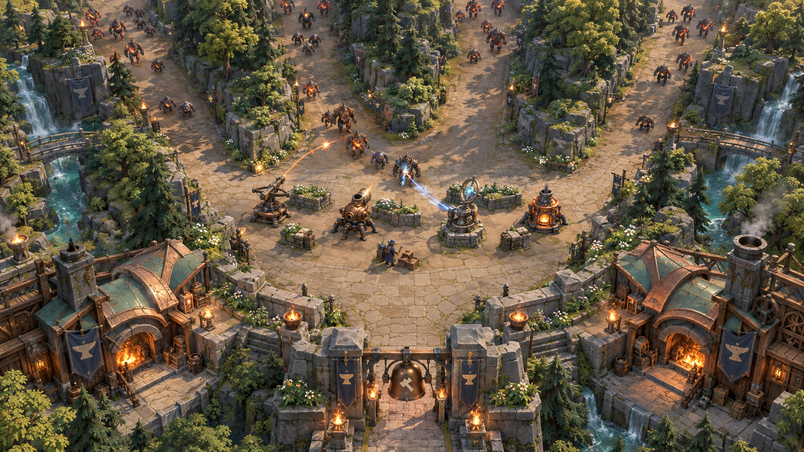

# From the Ironfold concept to the playable world

The user selected this direction on 2026-10-10: bring the actual game closer to the blank-canvas concept while keeping the maps' form. The concept is the visual target for composition, architecture and materials. It is not a screenshot or a new navigation layout.

## What changes in the approach

The strongest differences are large forms: lanes sheltered by rooted woodland and rock, refuge architecture with weight and curved copper roofs, and a continuous inhabited landscape. Repeated small decorations on flat shelves cannot carry that composition. Keep broad readable lane floors and reserve detailed surfaces for the surrounding world and landmarks.

The first implementation replaces Ironfold's primitive inner grove cores with painted canopies over interlocking slate banks, adds rock groups only where the full footprint and air clearance permit them, dresses a bounded number of cooling-channel margins with rooted rock and woodland, and reshapes the paired Anvilheart halls with swept copper roofs, ribs, masonry gables, braces and open stone chimneys. Rimewatch keeps its distinct snow and timber architecture for this pass. The new art is original repository-authored geometry using existing original textures.

The authoritative layout stays untouched. Every source map cell, lane, spawn, exit, tower footprint and route remains the same. New interior geometry belongs only on already impassable cells and is checked with the existing complete-triangle and flight-corridor tests. Shelf plants keep their existing solid-ground admission rule. Shore groups have a separate conservative rule: their roots must begin in original channel cells and their full windy footprint must fit entirely inside original channel/stone cells adjoining an existing stone bank; none may enter a buildable cell. Their number is capped and the cooling channels remain visible. The halls stay outside the playable rectangle. Both sides are still mirrored. Trees, cliffs and buildings do not acquire colliders or hidden reservations.

The concept's huge trees, apparent decorative obstacles inside the court and bell spanning the exit are composition suggestions, not permission to obstruct building or hide enemies. Actual gameplay must retain wall-tight placement, flight readability, the open refuge approach and the player's freely built maze.

## Remaining art work

This is a substantive first translation, not a claim of matching all the concept's fidelity. The narrower source-map shelves limit canopy breadth. Continue authoring continuous woodland masses within those boundaries, improve the smaller settlement buildings, deepen the ground/rock transitions and carry the same quality into Rimewatch with its own materials. Towers, enemies and character animation still need similarly deliberate forms. Evaluate each in paid gameplay at normal zoom, rather than judging isolated close-ups alone.

The [verification record and actual-game screenshots](Verification/Concept-World/README.md) accompany the source checkpoint. Scott Buckley soundtrack attribution stays intact. No online rules, economy, mobile scope or public release change is part of this art pass.
