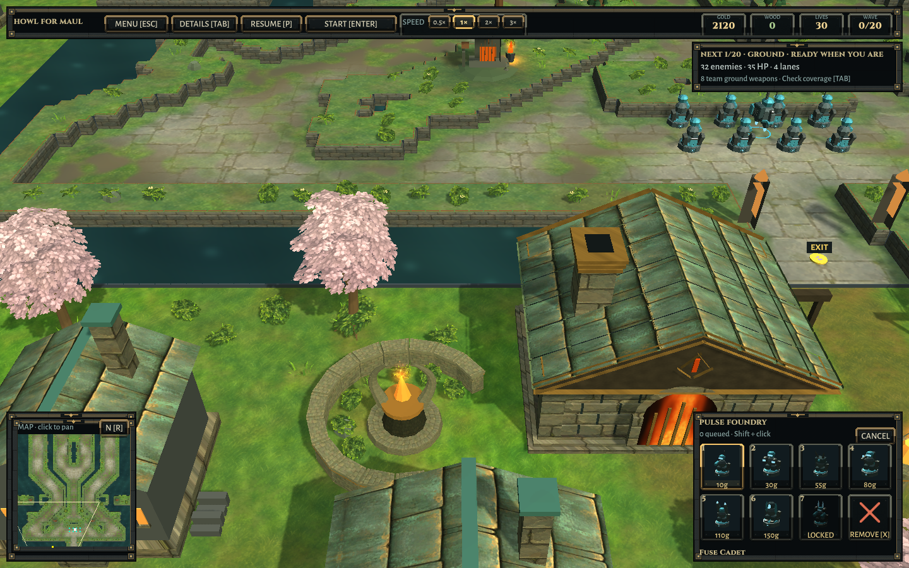
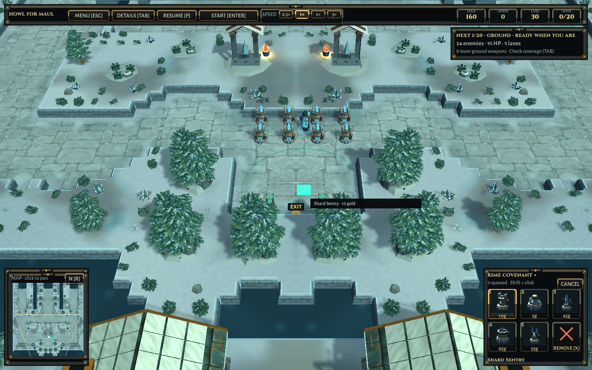

# A living refuge and planted lanes

2026-10-09. Environment pass following the supplied Dota refuge and League mid-lane references. Those screenshots guide composition, material transitions and atmosphere; none of their pixels or models are shipped.

## Ironfold Last Stand

The defended town now has paired curved stone gardens, split-hearth sculptures, tapered roadside wardstones, soft blossom crowns and planted paths around the existing refuge halls. The central road and the playable base approach remain open. Four new sanctuary hearth anchors join the existing glow, rising-ember and ambient-sound system; the renderer still lights only the nearest four hearths. The old solid exterior tree/shrub crowns have been replaced by layered painted foliage.

Original leaf textures are mapped onto bent, world-space branch meshes, with articulated trunks, roots, leaf gaps, cast shadows and gentle shader wind. They are not flat images of trees attached to the camera. Underplanting mixes low shrubs, fern-like fronds, bent grasses, small flowers and weathered stones. House envelopes and trails remain excluded from scattering. Gardens are grouped by a broad planting field rather than filling every available position uniformly.

## The rest of both maps

Painted canopies and undergrowth now dress safe blocked shelves and the surrounding world across Ironfold and Rimewatch. Ironfold uses reclaimed meadow greens, warmer earth, pale blossom accents and arched foundry hearths with tapered flues. Rimewatch uses separate snow-laden spruce textures, blue-grey evergreens, pale stone and warm refuge fires. Tall vegetation keeps clear of air routes; low plants can occupy safe ground beneath them.

New quiet flagstones replace the overly coarse paving. Ironfold's paving breaks into worn earth and meadow patches, with a more complete paved refuge approach. Snow, moss and ground colors blend toward the lane shoulders. Close-view meadow detail adds brushwork without repainting during play. Water channels have slow, mirrored ripples and subdued sky glints. Sunlight, ambient fill and two shadow cascades give the foliage depth over a longer distance.

Static surface paint still ships as baked assets. The signature and editor dependency list include the changed artwork, so the fast map-switch path remains available. Custom/changed masks still reject stale baked paint.

## Gameplay and resource boundaries

No simulation, economy, map-mask, faction, wave or networking rules change. New scenic geometry has no colliders. Every complete inside-map planting footprint includes a wind margin, stays on blocked source cells and is checked against tall flight corridors. Exterior geometry stays outside the playable rectangle and off the tactical map. Both halves mirror positions, mesh winding and texture coordinates. Materials and meshes owned by the new scenery are destroyed when maps change; imported texture assets stay shared. Wind runs on the GPU, without uploading the forest mesh from the CPU each frame.

The remaining interior landmark cores and game actors are still stylized procedural models. This is an implemented environment iteration toward the requested art direction, not a claim of Dota's entire production quality or a guarantee of frame rate on all machines.

## Assets

Four original textures were generated with the built-in image-generation tool and saved into `Assets/Game/Presentation/Resources/World`: `HearthLeaves.png`, `HearthSpruce.png`, `HearthMeadow.png` and `HearthWaystone.png`. Leaf sources have genuine alpha transparency; importer settings preserve coverage in mipmaps. The source PNGs were copied unchanged into the project. Full prompts, paths, dimensions and SHA-256 hashes are recorded in [LIVING-WORLD-ASSETS.json](LIVING-WORLD-ASSETS.json).

Geometry, placement, shaders and material integration are authored in the repository. Scott Buckley's soundtrack credits and font notices remain included.

## Verification

See [the structured record](Verification/Living-World/Verification.json) and its retained XML/checks for precise scope. The initial new test required more than three safe canopy groups on each half-map. Ironfold legitimately had three; the fixture was corrected to require a non-empty canopy while retaining the full geometry, air-route, wind-margin and house-clearance checks. No placement rule was relaxed to satisfy the test.

This pass does not claim a new full-campaign balance run, separate-network friends match or native Windows execution. The previous Relay evidence remains in [SHELTER-CHAT-RESULTS.md](SHELTER-CHAT-RESULTS.md).

The local launch path remains `Builds/Linux-World/HowlForMaul`, with the matching Windows package in `Builds/Windows-World`. Close an already-running player and relaunch to see the update.

