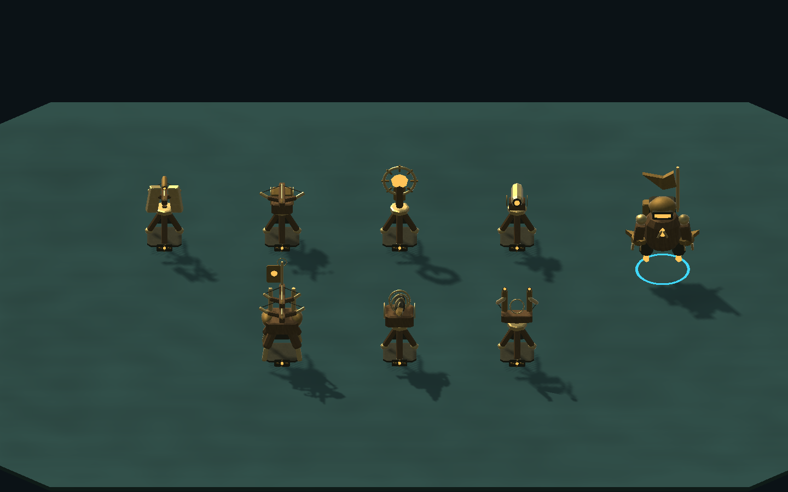

# Order materials and Horizon's field instruments

2026-10-10. The newly lit portraits made the remaining repeated weapons and arbitrary pastel colors easy to see. This pass gives all twelve orders deliberate actor materials and rebuilds Horizon's seven devices around its timber-and-brass surveyor identity.

Horizon now progresses from a low amber field scope, through a sun mirror, drum-fed crossbow, shielded watchbow, elevated twin sky harpoons and geared auger, to a walking double-ballista champion carrying the guild standard. The six regular instruments use fitted tripod joinery. The champion has four articulated supports. Each weapon has its own proportions and open space; the old common bow glued underneath every unrelated device is gone. The existing names, targeting, costs and champion prerequisites remain.

Actor pigments no longer come from an evenly spaced hue formula. Pulse has subdued cyan enamel, Blast violet fittings on copper, Prism teal signal glass and ivory, Horizon warm brass and oak, Gravity purple cores and bronze, Scrap reclaimed green and rust, Overdrive red furnaces, and Tidal patinated blue-green shells. Rimewatch's four orders also have quieter pigments and purposeful core lights. Builders, actual-model portraits and placement previews inherit these materials. A live combat capture exposed the old pink Horizon shots. Projectile colors now derive from the same order core palette, with per-weapon variations; all existing projectile shapes, sizes, travel timing and arcs remain. Ownership rings and sound identities stay separate and unchanged.

All geometry is original code-authored work. Rigid geometry still combines into shared meshes; this adds no per-frame geometry generation, new materials per unit or gameplay colliders. Rotated level-three models must fit the existing occupied cell, and previews must remain cosmetic. No map mask, build rule, economy, network or soundtrack change is included.

Evidence and platform limits are in [Verification/Order-Weapons](Verification/Order-Weapons/README.md). This is a bounded roster improvement, not finished commercial character art. Other factions still have repeated primitive weapon details; authored surface painting, builder animation and stronger individual roles remain useful follow-ups.

