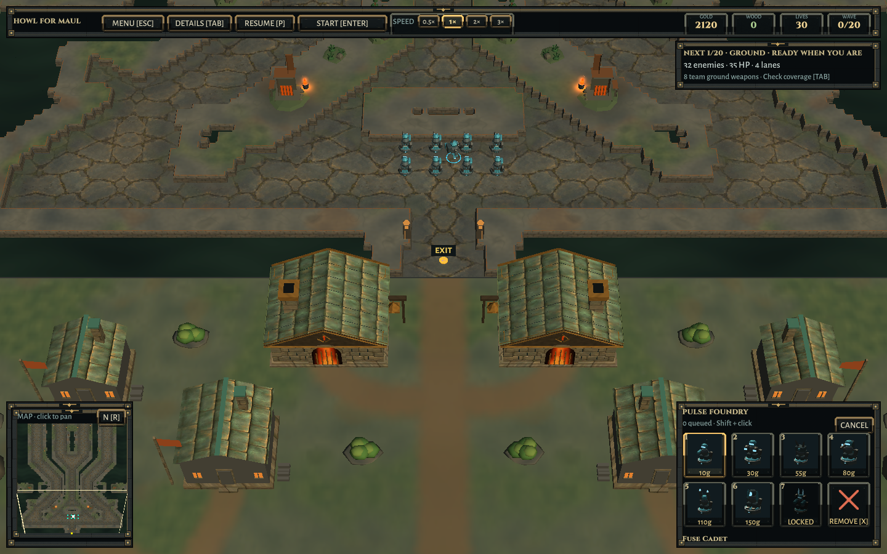
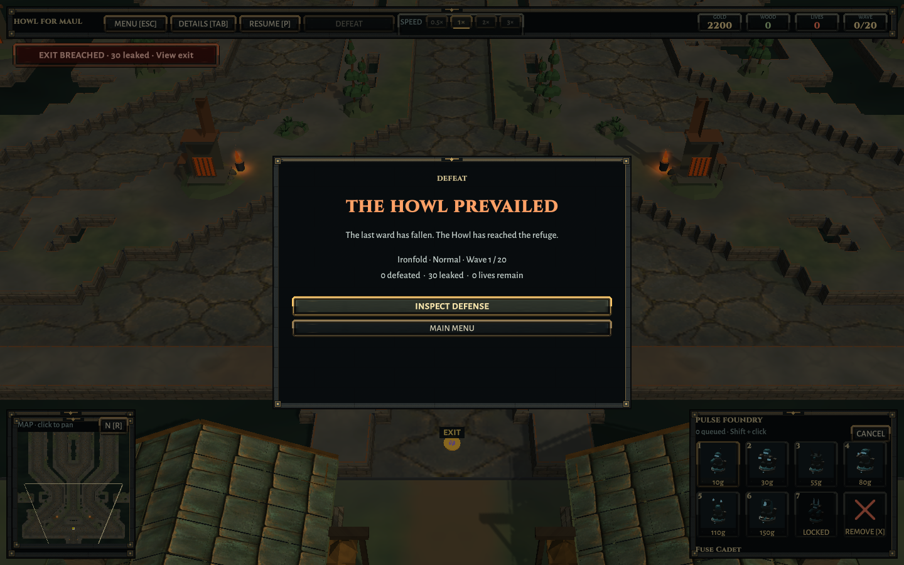

# Sheltered scenery, faster map switching, chat and results

2026-10-09. Follow-up to the screenshot of rocks inside village roofs, slow menu map changes, the request for team chat, and the missing defeat announcement.

## World presentation

Exterior scattering now shares planned building envelopes with the village and refuge construction. Clearances include roofs, yard props and the entire rock/tree radius, on both mirrored sides. The terrain grades gently around foundations. Smoke sources now mirror the actual houses rather than appearing at independently authored, subsequently discarded positions.

The old individual cone peaks are replaced with broad rounded outcrops, layered pine boughs and clustered deciduous crowns. Soft normals, restrained garden wind and tree shadows give the surroundings more depth. Animated garden geometry is bounded; the whole distant forest is not uploaded every frame. Worn paths curve to doorways and blend into the ground texture, replacing opaque straight polygon strips. Smaller buildings receive entrances, thresholds, eave trim and masonry treatment. Both maps retain their own palette and exact playfield masks. No cosmetic collider or new build reservation is introduced.

This is a step toward the requested softer, more adventurous world. Many interior props and actors still need a stronger authored modeling/animation pass; it is not a finished League/Dota art-quality claim.

## Faster map selection

Static painted ground, shelves, water, walls and exterior trails are baked into shipped assets. Building either desktop player checks the inputs and regenerates changed paint automatically. The signature includes biome, geometry, source mask and lane data; custom/changed maps fall back to live painting rather than displaying stale surfaces. Shared imported textures are not destroyed with the outgoing scene. Clicking the already-selected map in an unused setup no longer reloads it.

A controlled packaged comparison measured Rimewatch construction at 10,624 ms with runtime painting versus 851 ms with baked surfaces. These are construction measurements, not complete application startup. Actual final menu switches, including the scene change, measured 1,079–1,328 ms at 960×600; the preceding 1440×900 pass measured 1,141–1,528 ms. Measurements are local, not a hardware guarantee. The expensive work still occurs during an asset bake, where it does not interrupt players.

## Team chat

Lobby and multiplayer match chat uses **Enter to open/send** and **Esc to close**. The compact panel contains player names/colors, scrolling history and per-player local mute controls. Recent messages briefly appear above the minimap; the chat button blocks click-through building. Chat remains available while paused and after the match ends.

The host assigns the sender identity and sequence. Messages are plain text, limited to 240 UTF-16 code units without splitting a trailing surrogate pair; whitespace/control cleanup, a per-player burst/rate limit, a 64-message history cap and late-join replay are enforced. Chat packets do not enter the simulation command/tick stream. No external message service or public matchmaking was added. Existing host kick controls remain.

Typing captures game/camera hotkeys without pausing the match. In multiplayer, Enter belongs to chat; use the HUD Start / Send Now button for waves. Solo retains Enter for waves. All players must update together: the protocol is now `howl-direct-5`.

## Match results

The final lost life opens **DEFEAT — THE HOWL PREVAILED**, with map, difficulty, wave, kills, leaks and remaining lives. Victory opens **VICTORY — THE HEARTH STILL BURNS**. Inspect Defense closes the overlay while keeping the board available; View Results reopens it. Main Menu leaves the current online match. A new match clears the dismissed-result state.

## Verification and packages

- 73/73 pure simulation regressions pass.
- Three focused Unity cases pass: existing exterior/sound/playfield invariants; explicit scattered-triangle versus building-envelope checks and baked-map invalidation; chat camera capture and actual final-life defeat/review/restart behavior.
- Both packaged maps pass ordinary paid-defense, exact-mask and mirrored-refuge checks.
- Headless networking/chat tests cover authenticated identities, echo, literal text, Unicode truncation, spam limiting, mute, bounded/late-join history, paused delivery, unchanged simulation digest and existing multiplayer rules.
- Real keyboard injection into the isolated multiplayer player verified Enter → `qwer123 pgu x` → Enter: chat sends, simulation keeps advancing, and camera/build/pause shortcuts stay untouched.
- Actual UI captures inspected at 1440×900 and 960×600: lobby chat, match chat, defeat and victory. The victory screen uses a controlled valid final-wave fixture; this is not a new full-campaign balance test.
- Real Relay: both host/client game processes report success on both maps, including chat on both peers, two paid towers, 420 synchronized ticks, pause/resume and disconnect recovery. The first allocation timed out; a fresh allocation passed. The harness received shell status 143 after the final Ironfold PASS markers, so a clean harness exit is not claimed. See the retained checks.
- Linux runtime verified. Matching Windows cross-build succeeded; native Windows execution and a full friends match on separate networks remain untested.

The original failed fixtures are retained in the verification record. No scheduler/mobile work, copyrighted reference imports, balance changes or map-mask changes. Scott Buckley credits and font notices remain in the game and packages.

The updated Linux player remains at `Builds/Linux-World/HowlForMaul`; Windows at `Builds/Windows-World/HowlForMaul.exe`. The previous local packages are preserved alongside them. Friend archives are prepared in the Codex workspace under `outputs/Friends-Playtest-ShelterChat`; no release upload is claimed.

[Structured checks](Verification/Sheltered-World/Verification.json) · [Compact results](Verification/Sheltered-World/Checks.txt)

