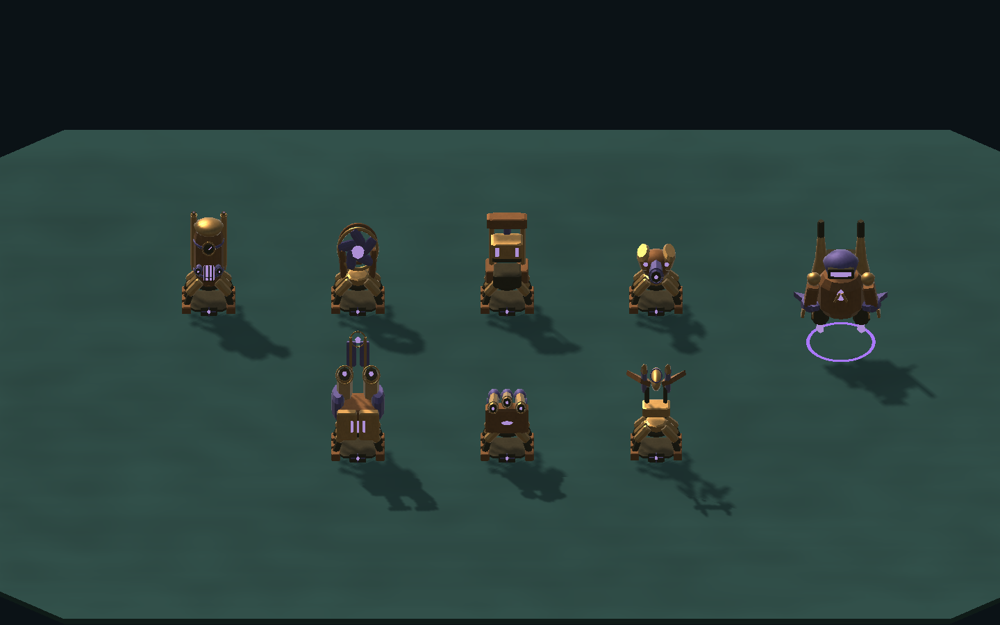
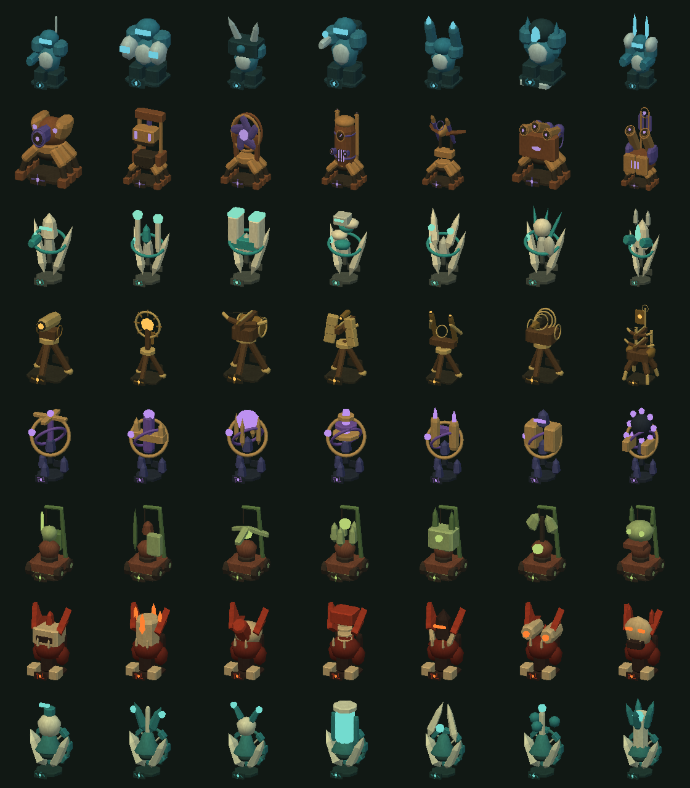
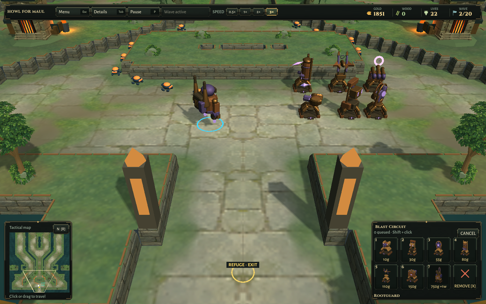

# Blast Circuit engine verification

2026-10-10 · base source c771e38 · Unity 6000.3.25f1 · OpenGL llvmpipe on private Xvfb :98.

[Five roster/preview cases](Roster-Preview-Tests.xml) and [two combat/progression cases](Combat-Progression-Tests.xml) pass. Existing tests were not changed. The complete 76-design roster covers upgraded, diagonally aimed model vertices inside their cells, no actor colliders, paid construction, builder ownership/movement/pause, cached portraits and texture coordinates. All portraits remain readable without altering world lighting. Placement previews remain cosmetic, cached and allocation-free over warmed updates. Shot/recoil/pause, all 72 damaging projectile identities and all eight Ironfold paid champion progressions retain their previous behavior. Champion wood is a stated fixture in that progression check; milestone reward timing is covered elsewhere.

The models and full portrait contact sheet were rendered by Unity and inspected. These stages are presentation fixtures rather than a played campaign. They show all seven mechanisms, including the wood-gated champion, with their existing order and projectile colors. No new full-suite or full-campaign claim is made.

The actual Linux player was driven through title → Ironfold → Solo → Blast Circuit → Normal with real mouse/key events on the private display. All six regular designs were purchased for 10 + 30 + 55 + 80 + 110 + 150 = 435 gold: opening 2200 becomes 1765, zero pending orders. The normal and close cameras and full faction gallery were inspected. The UI's 3× and Start Wave controls were used; the first wave ended with 22 lives and 1845 gold (eight leaks). Wave two then started automatically. The retained live capture shows approaching enemies, re-aimed weapons, violet shots and bounty increasing to 1851 gold. The second wave ended with 11 lives and 1938 gold; pause was captured before the third wave. The player then closed normally with exit 0. This compact art-review layout is not a complete or balanced maze. No balance adjustment was made for it.

One short input helper ended with signal 143 after the two speed/start clicks; its final pointer move did not complete. The owned player/display remained running. A subsequent pointer/movement/capture helper completed normally, and the screenshots confirm the requested speed and wave start. This was not a player crash.

[Packaged menu checks](PackagedMenu.txt) pass title/settings/credits, map switching, solo entry and resizing between 960×600 and 1440×900; small title and HUD inspected. Both desktop builds succeed. Installed candidates are Builds/Linux-World and Builds/Windows-World, with preceding c771e38 packages preserved. Executable/runtime/notices hashes match the isolated builds. All owned processes are closed and the isolated target is restored to Linux. No public release was made.

Packaged-play details and source/package hashes are recorded in [Verification.json](Verification.json). Windows execution, hardware FPS and separate-network multiplayer are outside this bounded model pass. Scott Buckley music credits remain unchanged.

