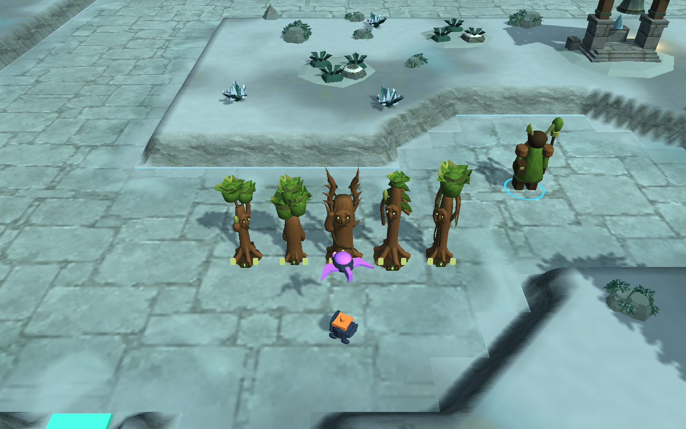

# Briar Elder: the thorn guardian — 2026-10-10

Base source: `9ddf813`. Requested by the player as a tree that throws thorns.

Rootbound’s former Burr Elder is now **Briar Elder**, a twisted hawthorn. Its exposed forked crown, hooked wooden thorns, sparse leaves, winding vine and loaded throwing hand distinguish it from the other four trees. Three tapering, barbed brown thorns replace the round thorn-pod projectile; impact splinters retain the existing ground-splash attack. Original geometry uses shared meshes and one renderer per projectile event. No imported art is used.

The name and description update in both the scenario factory and serialized map. Design ID 7, 65-gold price, refunds, damage, splash radius, timing, range, targeting, health, upgrades and cell footprint are unchanged. The crown and arm retain simulation-driven movement and pause behavior. Portraits and construction previews use the updated real model. Sounds and music remain unchanged.

## Verification

- **7/7 relevant Unity presentation cases pass** (`Unity-Presentation.xml`, 10:23:11 UTC): all 76 model silhouettes, upgraded/diagonal cell envelopes, portrait and preview reuse/cleanup, projectile identity/lifecycle/pause, the paid role fixture and the paid Rootbound grove.
- The grove constructs all five designs for **228 normal gold**, then uses an explicitly added 1000-gold later-game fixture to test level-three animated clearance. Ground/air damage, throwing poses and pause remain covered; this is not a claim that every upgrade is affordable at match start.
- Packaged Linux world checks pass for both maps: Ironfold eight paid defenses / 80 gold; Rimewatch six paid defenders / 240 gold, including every Rootbound design. The short combat fixture uses synthetic ground and flying enemies. Masks, mirrored scenery and centred R pass.
- Packaged menu/settings/credits/map selection/solo/resize checks pass. Actual model gallery, thorn projectiles, close/normal gameplay, packaged defense and the 960×600 HUD were inspected. Cards are intentionally dim when the QA defense has spent all opening gold.
- Linux and Windows builds succeed. Windows is a cross-build only; no native Windows execution is claimed. The isolated project returned to Linux and owned processes were closed.
- Reversing the two data strings reproduces both base data files exactly. Ironfold and all ten baked surface PNGs are byte-identical. Changed source matches the isolated project; installation hashes are recorded in `Verification.json`. Scott Buckley attribution remains bundled.

Local candidates are installed in `Builds/Linux-World` and `Builds/Windows-World`; preceding packages are preserved as `*-World-9ddf813`. **Published Playtest 1 is unchanged.** No fresh full campaign, network/Relay session, hardware GPU profiling or full Unity-suite pass is claimed. Other faction models remain as before; this is a targeted tree/attack art improvement.

## Captures

- [Rootbound family](Rootbound-Gallery.png)
- [Normal camera distance](Paid-Normal.png)
- [Thorn cluster alongside the other seeds](Thorn-Projectiles.png)
- [Packaged defense](Packaged-Paid-Defense.png)
- [Small HUD](HUD-Small.png)
