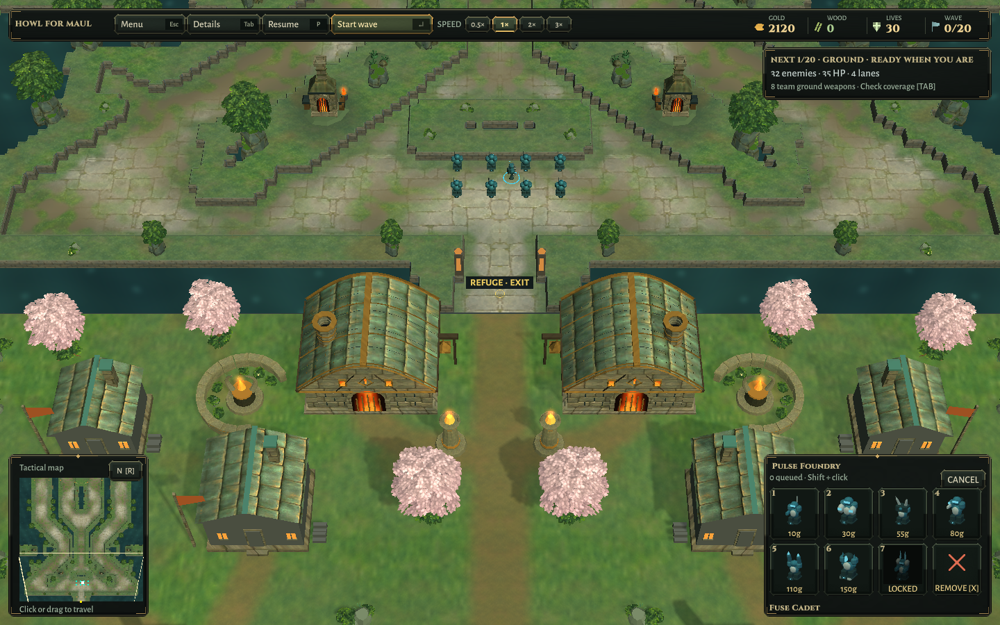
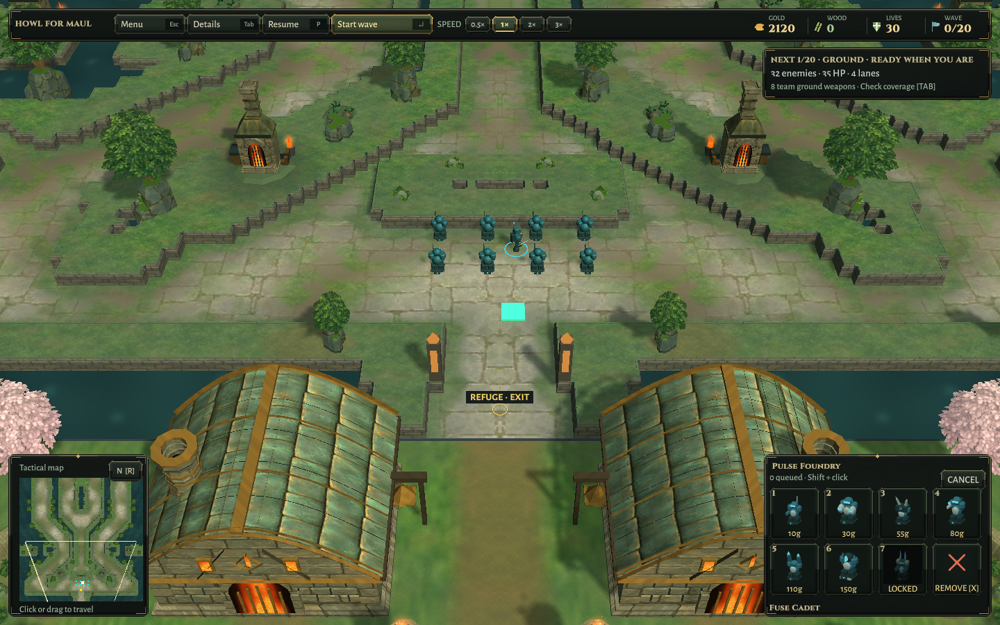
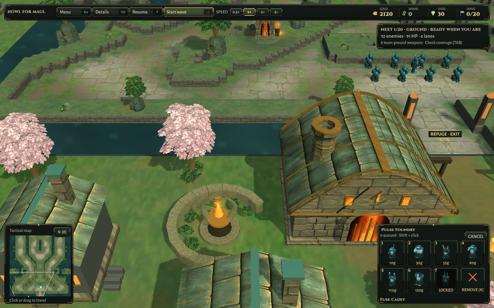
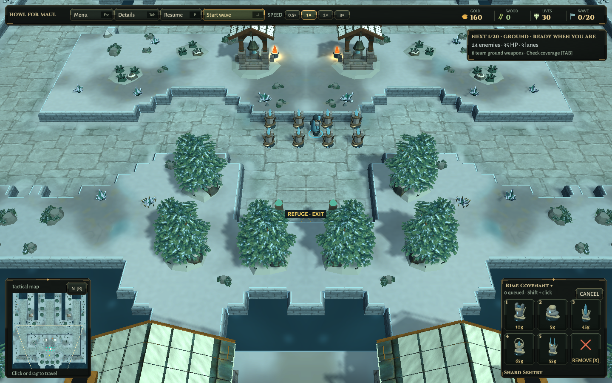
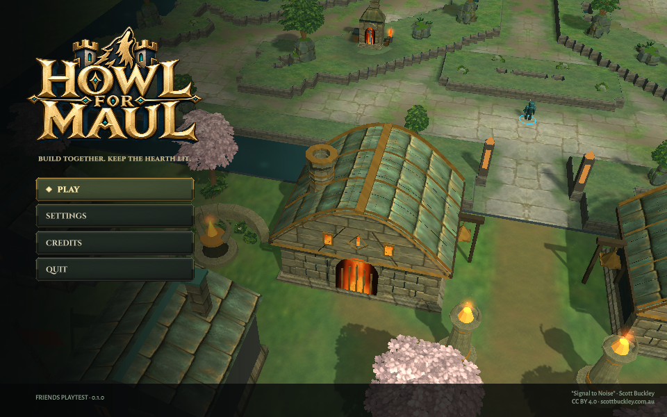
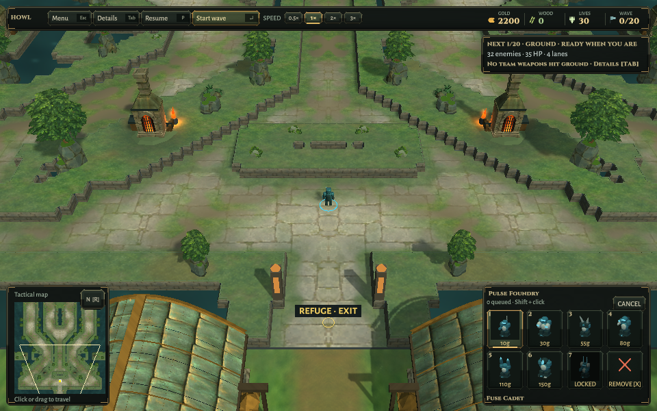

# Concept-to-world verification

2026-10-10 · base source 9842fa4 · Unity 6000.3.25f1 · Linux OpenGL llvmpipe, private Xvfb :98.

The target is the [selected Ironfold concept](../../Concept-Target/Ironfold-Visual-Target.png). Screenshots here are from the actual game. The concept is not a screenshot and its visual fidelity is not yet matched throughout the project.

The three focused cases check complete interior triangles against buildable cells and flying corridors, exact reflected geometry, house/tree clearance, baked paint validity, changed-mask rejection, material cleanup, paid work and ambient audio. An added bank count/vertex bound checks that the new geometry exists within a fixed rendering budget. Shore groups are checked separately to fit only original channel/stone cells adjoining an existing stone bank; their entire mesh and wind envelope still pass the same no-build-cell and flight-clearance assertions. Ordinary shelf-plant admission is unchanged. No map-mask, placement, flight-clearance or mesh-budget threshold was relaxed.

First run: 2/3. The halls had 20,358 vertices against the existing 20,000 limit. Reduced roof tiles and chimney ring subdivisions rather than increasing the budget. Second run: 2/3. The legacy CPU tree-motion assertion correctly found that Ironfold's removed solid grove cores no longer move. The replacement test isolates the new painted canopy on its own render layer and compares frames while combat is paused; it also disables wind and requires an unchanged control frame so fire, water or camera movement cannot create a false pass. Rimewatch retains its legacy-motion assertion. The next run passed 3/3 before the final denser-bank refinement.

No native Windows, hardware frame-rate, full campaign or separate-network match claim is made for this art pass. Economy, online state and audio content are unchanged. No paid/public release or scheduler change.

Final focused run: **3 passed, 0 failed**, ending 05:22:19 UTC. Subsequent denser-bank and shoreline iterations also passed; the initial isolated shore trees were revised after visual inspection to join existing stone with larger canopies. Final source-side counts are 20 bank groups, including 14 shore groups, reflected exactly. Ironfold refuge geometry totals 18,870 vertices, below the unchanged 20,000 cap.

The final rebuilt Linux world check passes on **both maps**: eight real paid towers / 80 gold each, unchanged masks, mirrored refuge geometry, and short combat against synthetic ground/flying targets. This is an automated packaged-scene check, not a fresh human-input session or a new campaign balance result. Settlement, Last Stand, close architecture, paid-defense and overview renders were inspected. Rimewatch remains a regression control for this primarily Ironfold pass. Earlier renders were not used as final-source evidence; one intermediate wrapper omitted a rebuild, and the correct build-plus-world pipeline was rerun before retaining the final captures.

Final menu/title/settings/credits/map/solo/resize smoke passes; small title and HUD inspected. Linux and Windows builds succeed. Windows remains cross-build only. Local candidates are installed at `Builds/Linux-World` and `Builds/Windows-World`; preceding 9842fa4 packages are preserved as `*-World-9842fa4`. Executable/runtime/notices/music-source hashes match the isolated builds, changed source/assets match the clone, authoritative map assets are byte-identical to the base commit, and baked PNG bytes are unchanged. Scott Buckley attribution remains bundled. All owned processes are closed; the isolated editor target is restored to Linux. See [exact hashes and limits](Verification.json).

