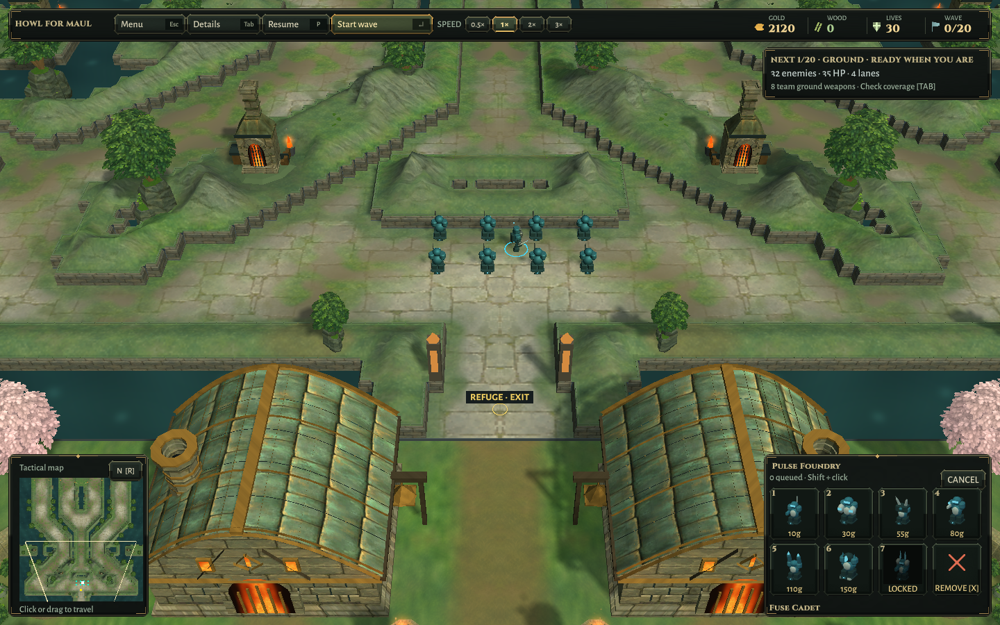
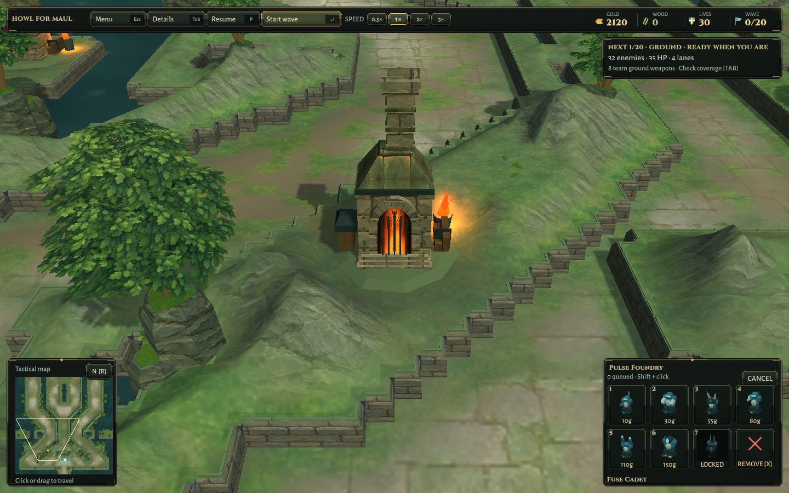
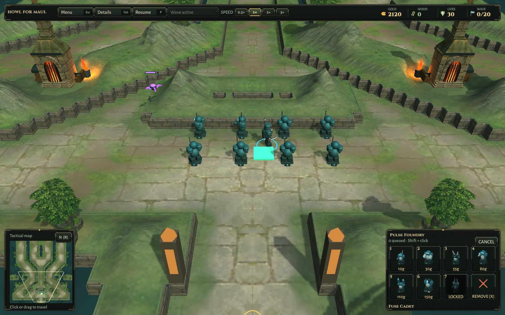
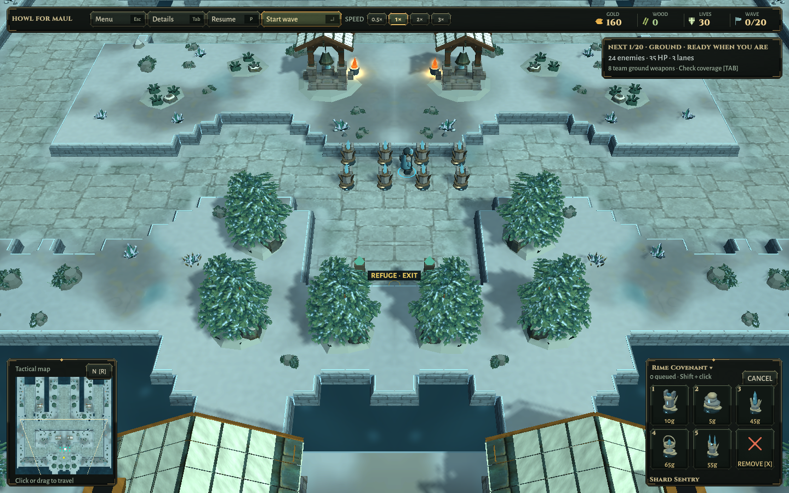
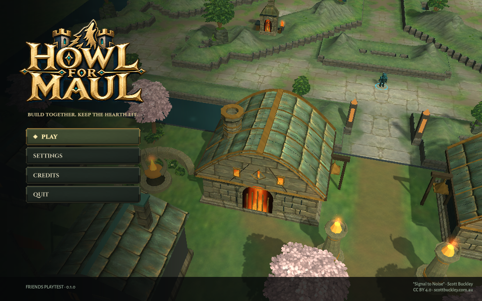
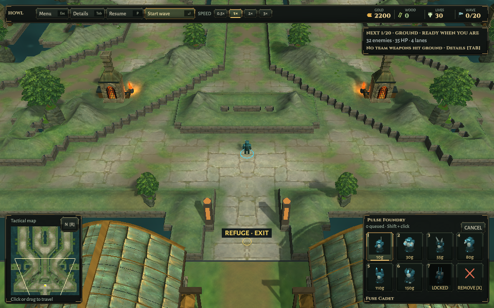

# Connected banks — retained verification

2026-10-10, Unity 6000.3.25f1. Base source `0872b91`. [Implementation](../../CONNECTED-BANKS.md), [structured record and hashes](Verification.json).

Final focused Unity run: **3 passed / 0 failed**, completed 05:49:13 UTC. Complete rendered triangles remain clear of build cells and tall flight corridors; reflected vertices match; paid construction charges the real wallet; map changes clean up owned materials; existing canopy wind, paused combat, hearth audio/light budgets, exterior roof clearances and baked-surface checks pass. Ironfold adds 1,770 quads before reflection (14,160 vertices afterward) in one static batch. Existing bank groups remain 20, including 14 shoreline groups, before reflection. No safety limits were relaxed. This is a focused suite, not the entire test suite.

Four passing iterations are retained. Initial renders exposed hard meadow/stone tiles; continuous blending removed those. The next close-up exposed different lighting at the foot of the slope. The final shader uses the same URP lighting and roughness as the original shelf. The new natural slate was reviewed as an image and on the actual meshes. Visual inspection drove these repairs even though the clearance tests were already passing.

The final rebuilt Linux package passes world checks on both maps: **eight real paid towers / 80 gold each**, unchanged masks, mirrored refuge geometry and short combat against synthetic ground/flying targets. These are automated scene checks, not a new human-input playthrough or full campaign balance run. Normal Last Stand, close landmark, overview and paid-defense renders were inspected; Rimewatch remains the unchanged art regression control.

Final title/settings/credits/map-change/solo/resize checks pass. Small title/HUD captures were inspected, including the visible Scott Buckley credit. Linux and Windows builds succeed; Windows is a cross-build only. Installed candidates are `Builds/Linux-World` and `Builds/Windows-World`, with preceding packages preserved as `*-World-0872b91`. Every installed package file matches the isolated output (193 Linux / 195 Windows files); modified source/assets match that project. Both authoritative map files and all ten baked PNGs are byte-identical to the base. Existing baked dependency fingerprints remain valid after baking. Bundled music/source notices are unchanged.

All owned Unity/player/private-display jobs closed successfully and the isolated editor target was restored to Linux. No native Windows, hardware performance, fresh separate-network match, full-suite or paid-release claim. No new public release. Trees, retaining-wall shapes and smaller settlement models still need further art work to approach the selected concept; this pass does not finish that wider ambition.
