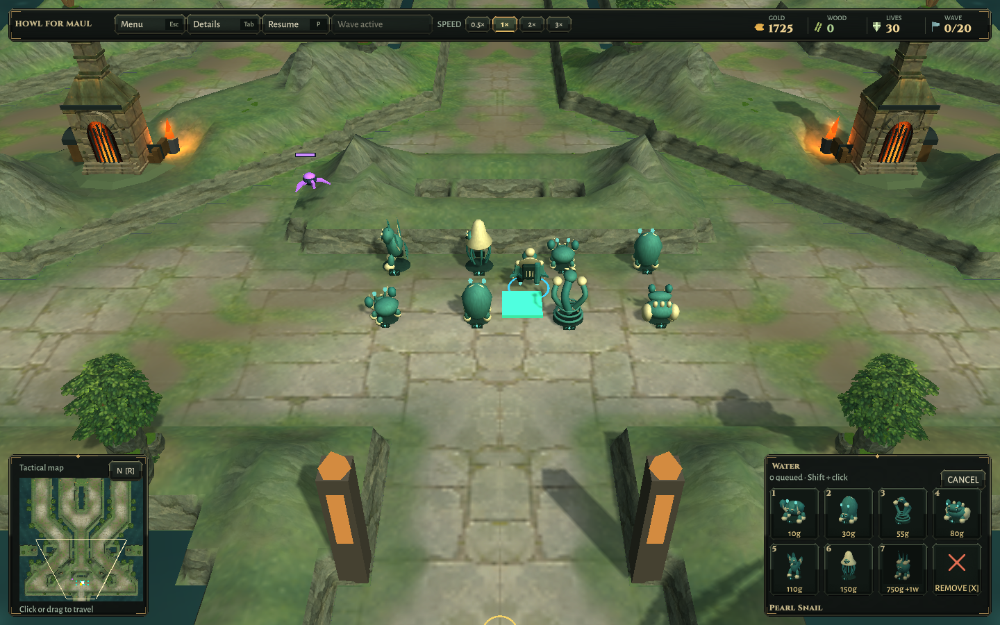
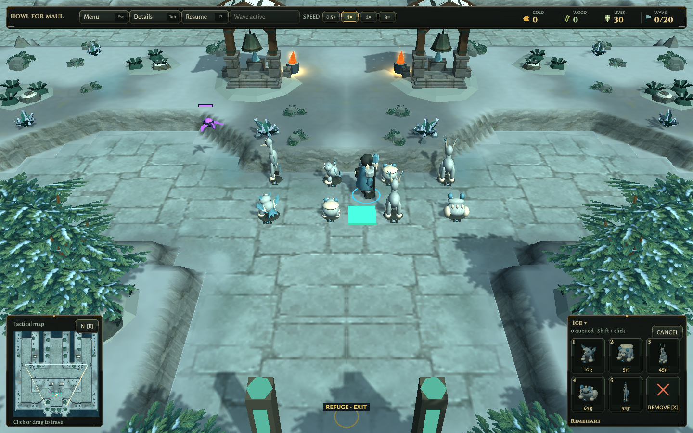
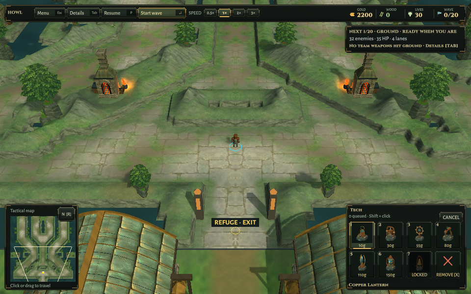

# Construction hitch verification

2026-10-10. Source baseline: `9b9ff1340d6ab61c3ae2e56a4f1c1dd953e53191`; the published game preceding this fix is `f6ca21f`. Exact changed-file hashes, installed package hashes and test counts are in [Verification.json](Verification.json). [Implementation](../../CONSTRUCTION-PERFORMANCE.md).

## Routing and performance

[Before](Benchmark-Mono-Before.txt) / [after](Benchmark-Mono-After.txt) use Unity's bundled Mono against an isolated 160-tower routing fixture: 13 Ironfold and 9 Rimewatch destinations, radius 0.2, eight warmed edits. Original routing is compiled from the baseline source; the same grid uses the new event/count helpers, which old routing does not call. Medians fall from 1,856.64 to 17.41 ms and 1,240.56 to 12.49 ms. This is an isolated CPU navigation comparison, not a prepatch whole-player profile.

The equivalent .NET before/after logs are retained. The final checked-in benchmark reuses its stopwatch; the external Mono harness allocates one stopwatch per edit, so its 40–100 byte allocation sample includes measurement overhead. Original route edits allocate roughly 1.2–1.7 MB. Timings are samples from this development machine under ordinary system load, not controlled target-hardware guarantees. An orphaned preceding-release smoke process was later found consuming CPU and stopped; these samples were not rerun to select better numbers.

[75 simulation regressions](Simulation.txt) pass. Added cases compare every exact distance and next-node value with an independent sorted-Dijkstra/full-tower-scan oracle; cover multiple radii/resolutions, diagonal gaps, goal regions, normal/breach routes, multi-bucket footprints, build/sale/destruction and permanent terrain changes. A 64×64 fixture verifies local edits avoid whole-map collision scans, destinations share collision work, route arrays survive edits, and 10,000 warmed queries allocate zero.

## Real paid gameplay

[Final Unity run](Unity-Final.xml): **77/77 passed** in 84.02 seconds. Includes all 75 simulation cases, paid construction during an actual first wave, and the two existing historical twenty-wave two-player Hard campaign replays. Campaigns retain exact paid purchases, wallets, travel, kills/leaks and presentation checks.

[Paid-Live-Waves.json](Paid-Live-Waves.json): Ironfold pays for 48 initial towers then eight during combat with 32 active enemies. Rimewatch pays for eight initial towers then three with 24 active enemies. Construction ticks take 17.96–18.91 / 6.82–10.48 ms; explicit view synchronization adds 1.91–2.41 ms. The fixture checks charged gold including earned income, no clipped ground enemy, locally bounded collision updates, and exact real tower/view identities. It uses the real builder and simulation orders, driven by automation rather than mouse input. Gameplay is stepped explicitly while the editor's automatic advance is paused, so these are CPU samples rather than frame timings.

Two failed fixture iterations are retained: requesting too many separated build sites, then counting the pointer's cosmetic preview as a constructed tower. The final fixture uses achievable paid counts and verifies positive-ID views belong to the actual grid. No game rules were relaxed to satisfy either check. An isolated Editor license/config failure preceded these runs; the normal Editor environment resolved it without user account changes.

[Network.txt](Network.txt) passes local headless lobby/gameplay checks and two-process sessions on both maps: paid remote builds, ownership, shared speed, pause/resume and 620 ordered ticks. No fresh live Relay, separate-network, four-player or complete online match was run.

## Packages and inspection

Linux and Windows builds succeeded. The Linux packaged data checks, both-map world checks and title/settings/credits/map selection/solo/resize checks passed; see retained summaries. Paid-defense images from both maps and the small HUD were visually inspected: current creature models, placement, terrain, minimap and interface render normally. These images document packaged presentation, not the measured 48→56 tower performance fixture.

Every installed candidate file matches the tested output. Preceding local packages are backed up as `Linux-World-f6ca21f` and `Windows-World-f6ca21f`, with their existing recorded tree hashes verified before replacement. Changed Unity sources match the isolated build project. Map definitions and all ten baked world textures match the baseline. Scott Buckley and bundled third-party notices remain included. The isolated project returned to Linux afterward.

Native Windows execution, GPU/FPS performance, arbitrary late-wave crowds and human input are unverified. Full distance propagation and first-use radius preprocessing remain synchronous; this fixes the reproduced source of multi-second build stalls, not every possible stutter. Published Friends Playtest 2 remains unchanged; use matching builds online. No paid release or service setting changes.
