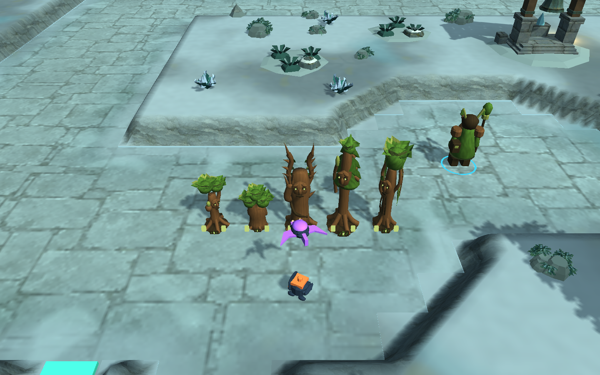

# Defender recognition — 2026-10-10

Base source: `e0932fe`. [Design changes](../../DEFENDER-READABILITY.md).

## Evidence

- **8/8 focused Unity cases pass** in `Unity-Final.xml`: all 76 models at upgraded/diagonal cell bounds; all 12 factions in small portraits and two fixed silhouette views; preview cache/reuse/cleanup; projectile presentation/lifecycle/pause; paid role/camera checks; and the animated paid Rootbound grove. This is not the full Unity suite.
- `Unity-Baseline.xml` intentionally fails the newly added near-duplicate guard on the previous runtime: 38 of 208 within-faction pairs average at least 90% silhouette overlap. `Before-Pairs.tsv` retains those comparisons.
- The first changed runtime passes 6/8 (`Unity-First.xml`). The test found one static rotated-part cell overrun and three remaining similar pairs. The final geometry fixes all four; `After-Pairs.tsv` has **0 of 208** pairs above the guard. The highest remaining mean is 89.21%. Silhouette overlap is a diagnostic, not a substitute for human recognition testing.
- The paid Rootbound fixture buys all five designs for **228 normal gold**. An explicitly added 1000-gold fixture subsequently checks level-three geometry. It is not an opening-wallet upgrade affordability claim.
- Packaged Linux world checks pass on both maps: Ironfold eight paid defenses / 80 gold; Rimewatch six paid defenders / 240 gold, including every Rootbound design. Short synthetic ground/air combat, mask preservation, mirrored scenery and centered R checks pass. Menu/settings/credits/map selection/solo/resize checks pass.
- One initial standalone run was interrupted when its private display closed (exit 143); that incomplete run is not counted as a pass. The subsequent standalone run completed. All final 64px sheets, selected larger galleries, paid close/normal captures, packaged defense and the 960×600 HUD were visually inspected.
- Linux and Windows builds succeed. Windows remains cross-build only. The isolated target returned to Linux. Changed/new Assets match the isolated test project. Both scenario assets, the faction data factory and all ten baked map PNGs match base bytes.
- Installed package trees match the tested build output; hashes are in `Verification.json`. Scott Buckley attribution and music source notices remain bundled. Previous packages are preserved as `*-World-e0932fe`.

No new full campaign, separate-network/Relay match, human input session, hardware performance measurement or native Windows execution is claimed. The other families' full creature redesigns are still future work. Audio is unchanged. **Public Playtest 1 is unchanged.**

## Small-size review

Each sheet uses the actual roster order from left to right. Top: 64px color portrait. Middle: fixed-scale white silhouette facing north. Bottom: the same model at a 45-degree camera turn. Consistent silhouette framing preserves relative size; the portraits retain the game's normal framing.

| Rimewatch | Ironfold |
|---|---|
| [Rime Covenant](Rimewatch-0.png) | [Pulse Foundry](Ironfold-0.png) |
| [Rootbound](Rimewatch-1.png) | [Blast Circuit](Ironfold-1.png) |
| [Ember Assembly](Rimewatch-2.png) | [Prism Division](Ironfold-2.png) |
| [Volt Vanguard](Rimewatch-3.png) | [Horizon Guild](Ironfold-3.png) |
| | [Gravity Works](Ironfold-4.png) |
| | [Scrap Frontier](Ironfold-5.png) |
| | [Overdrive Order](Ironfold-6.png) |
| | [Tidal Array](Ironfold-7.png) |

[Previous Overdrive sheet](Before-Overdrive.png) shows the repeated wing outline that hid the weapon differences. Further captures: [Rootbound gallery](Rootbound-Gallery.png), [normal playing distance](Paid-Normal.png), [packaged defense](Packaged-Paid-Defense.png), [small HUD](HUD-Small.png).
