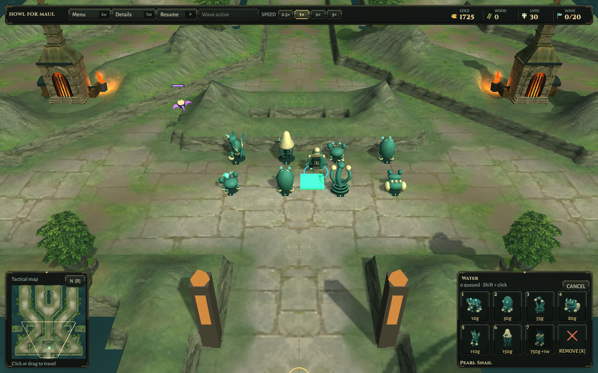
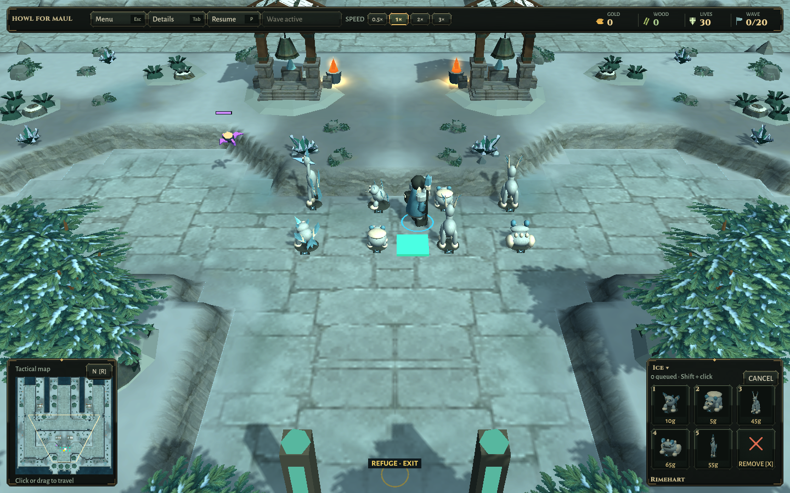
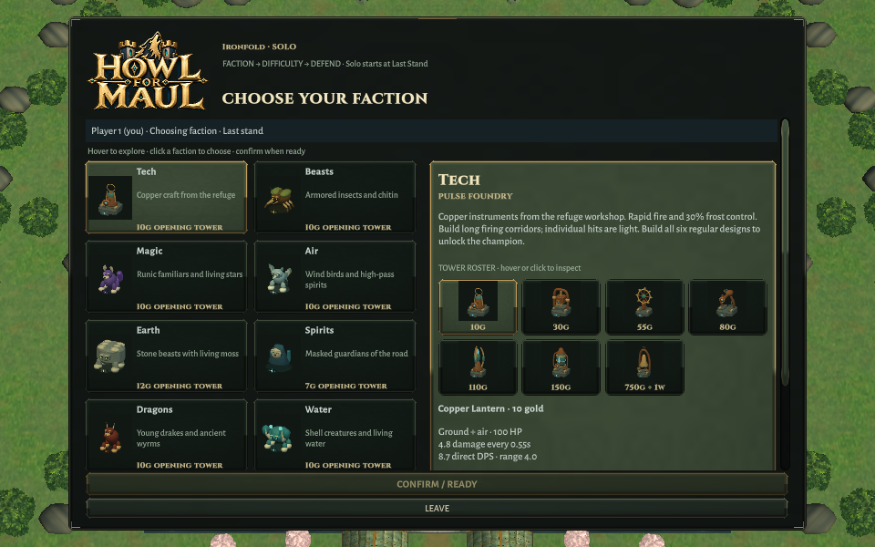

# Elemental factions — verification, 2026-10-10

Source base: `711469f`. [Implementation and all 76 names](../../ELEMENTAL-FACTIONS.md). [Machine-readable evidence and package/source hashes](Verification.json).

## Passed

- 73/73 pure simulation regressions. The first 69/73 run exposed a real identity-table bug when an Ironfold roster was applied to the generic winter-themed test scenario, plus an old display-name assertion. Roster application now selects its identity table explicitly; advice tests read the configured defender names. Numeric rules remain unchanged.
- 13/13 focused Unity cases: factory/serialized roster parity; 64 new creature articulations, shot response, pause and diagonal level-three cell envelopes; all 76 model bounds; paid Ironfold champion progression and Rimewatch roles; Rootbound grove; actual previews/portraits/projectiles; all 228 sound variations, stereo samples, mixed headroom and cleanup.
- All 12 small sheets inspected. 208 within-faction silhouette comparisons at 64px from 55° pitch, 180°/225° yaw: zero pairs at or above 90% mean overlap; maximum 88.69%. This rejects near duplicates; it does not prove human instant recognition.
- Two complete historical two-player Hard campaigns replay through the actual Unity scene with renamed designs resolved to stable indices. Every purchase/travel count, kill/leak result and wallet matches its ledger. Views show the paid level and zero colliders, steady-state view synchronization allocates zero managed bytes in this fixture, and restart releases views. This is automated replay, not a new human playthrough or hardware performance result.
- Packaged Linux world checks: eight Water defenders for 475 gold on Ironfold; eight Ice defenders for 240 gold on Rimewatch. All five Ice and six regular Water designs are represented; Water’s champion is tested separately with paid progression. Three synthetic enemies exercise short combat. Masks, mirrored refuge and north-centered reset pass.
- Packaged menu/settings/credits/map/solo/resize checks pass. Short family descriptions replace clipped faction-card sentences. Final 960×600 chooser and Ice HUD inspected.
- Linux and Windows builds succeed. Installed candidates match the tested output files and preserve Scott Buckley notices. Previous local builds are kept in `Builds/*-World-711469f`. The isolated project is restored to Linux.
- Parsed map assets match the base after excluding only Name/Description fields. All baked world textures are byte-identical. No changes to terrain, costs, wave data, targeting, ownership or networking rules.

## Failures retained

[First Unity iteration](Unity-First.xml): 11/13. Hailtoad and Slumberbear were too similar; the toad now has a lower, broader body, raised eyes, wide mouth and folded haunches. An idle test sampled too near an animation extremum; it now samples a longer interval and either rotational or positional movement.

[Second iteration](Unity-Second.xml): 11/13. Earth’s ram was too similar to its bear/tortoise, and the old shared-foundation assertion expected a stone column after the foundation became an organic shell. The ram now has an upright chest, narrower body and larger curling horns; the mesh-sharing assertion remains and targets the intended shared shell. [Final 13/13](Unity-Final.xml).

A final review found that historical campaign purchase names also needed migration; the compatibility resolver was verified with [the full paid campaign replay](Unity-Paid-Campaigns.xml). The final menu description correction was rebuilt and checked in the packaged menu.

## Actual screenshots

All twelve `Map-index.png` files contain actual 64px portraits and color-free silhouettes in roster order. `Map-index-Gallery.png` files show the models at a larger diagnostic scale; the keeper at right retains prior anatomy. Large galleries read right-to-left in each row. [Family/slot names](../../ELEMENTAL-FACTIONS.md).

## Limits

This is a complete first thematic procedural pass, not finished sculpted character art. Some faces, joints and bird forms are visibly shared between related families. Builders retain their prior bodies with new palettes. Distinct species-specific keeper anatomy and more expressive attacks remain worthwhile follow-ups.

No human audio/mix approval, full Unity-suite pass, native Windows execution, hardware GPU profiling, fresh live Relay or separate-network match is claimed. Public Friends Playtest 1 remains unchanged; these candidates are local/source checkpoints. No new scheduler or mobile work.
