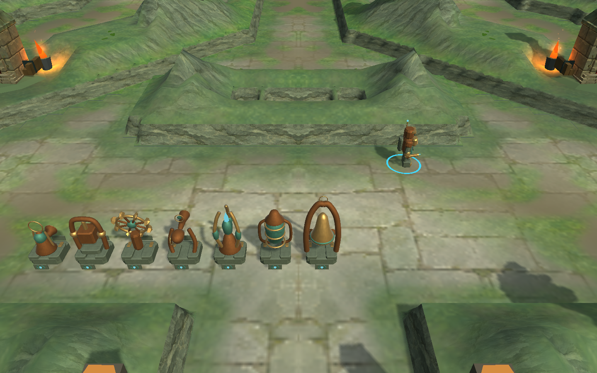

# Pulse Foundry workshop and centered camera — 2026-10-10

Base source: `8e3b1ac`. [Change and art direction](../../FOUNDRY-WORKSHOP.md). These are actual Unity game captures, not concept images.

Pulse's seven weapons now use copper, slate, brass and subdued verdigris. A lantern, hammer press, cutting wheel, sighting instrument, sky beacon, frost vessel and wardbell replace the repeated robotic bodies. Continuous curved frames replace the angular first iteration. Portraits and building previews use the actual models. Other factions have not been redesigned in this pass; the world still needs further art work to reach the selected concept.

## Verification

- The new camera projection regression first **failed against the old reset**, reproducing the sideways centerline. `Unity-Camera-Before.xml` preserves that expected failure. With the fix, **4/4 camera checks pass** (09:18:10 UTC), covering both maps, resets from both sides and rotation directions, three zoom levels, setup framing, title freeze and drag behavior. R retains zoom/depth but now returns to the map's symmetry plane as well as facing north.
- **7/7 presentation checks pass** on the final curved-frame models (09:26:45 UTC). They cover all 76 upgraded/diagonally aimed models and portraits, builders, construction previews, projectile identity, firing/pause, and paid champion progression across the eight Ironfold factions. The Pulse check spends the regular prerequisite costs and champion cost, then upgrades the champion. Wood is an explicit fixture; this is not a fresh milestone-reward check.
- The paid progression case was repeated with added wheel/wardbell assertions: **1/1 passes** (09:32:12 UTC). Neither mechanism moves during a real-time paused wait; both move when simulation ticks advance. This repeats one of the seven cases, rather than adding a twelfth unique test.
- Final packaged Linux checks pass on **both maps**: eight paid towers / 80 gold each, short combat with synthetic ground/flying targets, unchanged masks, mirrored terrain, and a centered map spine after R. This is not a full campaign or new human-keyboard session.
- Packaged title/settings/credits/map-selection/solo/resize smoke passes. Normal and close paid-defense captures, model gallery, both overview renders and the 960×600 HUD were inspected. Smaller HUD portraits retain different silhouettes.
- Linux and Windows builds report success. Windows is **cross-build only**, without native execution. The isolated project was returned to Linux; all owned Unity/player/private-display processes closed normally.

Current local candidates are `Builds/Linux-World` and `Builds/Windows-World`. Previous candidates remain at `*-World-5d34283`. Every installed file matches the tested isolated output. Changed source matches exactly; the only other isolated asset differences are Unity's trailing whitespace serialization, listed in `Verification.json`. Both map assets and all ten baked surface PNGs are byte-identical to the base. Scott Buckley and other bundled notices remain intact.

The public **v0.1.0-playtest.1 download is unchanged** and still contains the previous towers and camera reset. No new release or automation was created. The full simulation suite, native Windows, hardware frame time, mixed-defense listening and full separate-network matches were not rerun. No gameplay costs, stats, paths, occupancy, network or audio content changed.

## More captures

- [Model gallery](Pulse-Lineup.png)
- [Normal playing distance](Pulse-Normal.png)
- [Small HUD](HUD-Small.png)
- [Centered Ironfold](Ironfold-Centered.png)
- [Centered Rimewatch](Rimewatch-Centered.png)

Raw focused results, compact packaged logs, source/package hashes and scope limits are retained alongside this note.
