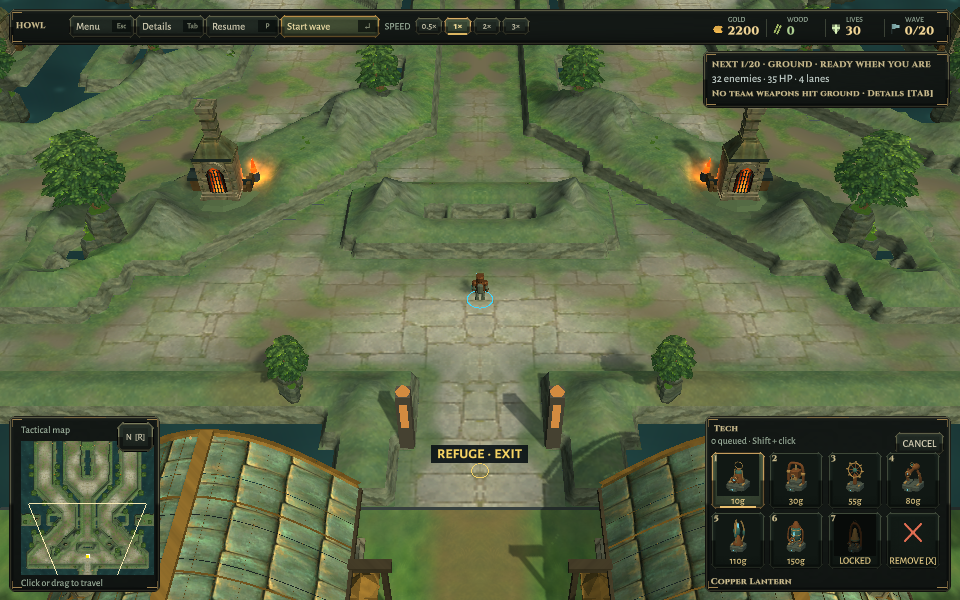
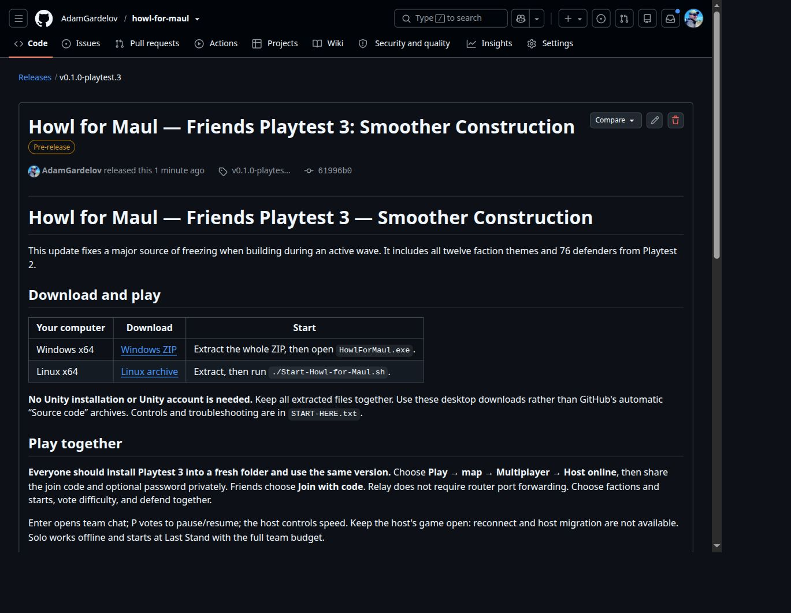

# Friends Playtest 3 — release verification

2026-10-10. Exact game source: `61996b05a402ab8f2800d678a554a665626f0252`. The annotated `v0.1.0-playtest.3` tag points to this verified performance-fix checkpoint. Underlying tests and CPU evidence: [construction hitches](../Construction-Hitches/README.md).

## Packaging and extracted runtime

Both original player trees and all recorded source hashes match the retained verification. Game/configuration source has no diff from the tagged commit. The package guard passed without modification.

Windows ZIP contains 197 files; Linux archive contains 196. All archive members were read back and hashed, both packages were extracted into fresh directories, and every payload hash, exact file count and build source revision were checked. Linux executable/launcher modes are retained. Complete Scott Buckley attribution, music sources, font licenses, start guide, build metadata and per-file hashes are bundled; logs and debug-only folders are excluded.

The extracted Linux binary passed both-map data smoke. The extracted shell launcher passed title/settings/credits, map choice, solo entry, settings and 960×600 / 1440×900 HUD checks. Small HUD screenshot was inspected. Both automated runs exited cleanly using software OpenGL on private Xvfb :98 and isolated preferences; hard cleanup timeouts were included. No fresh Unity build was needed because these exact game binaries were already built and verified.

Native Windows execution, hardware GPU/FPS, new live Relay, separate-network, four-player and complete live online matches remain unverified. The underlying source has 75 passing simulation regressions and 77 targeted Unity checks, including two full historical campaign replays and paid live-wave construction; not a complete Unity-suite or human-playtest claim. Headless two-process local networking passes on both maps. Previous live Relay evidence remains historical.

See the retained [manifest](RELEASE-MANIFEST.json), [checksums](SHA256SUMS.txt), [extraction evidence](Extraction.json), and [release notes](../../Releases/v0.1.0-playtest.3.md). Publication and anonymous-download evidence are recorded separately after verification.

## Publication

[Friends Playtest 3](https://github.com/AdamGardelov/howl-for-maul/releases/tag/v0.1.0-playtest.3) published at 2026-10-10T14:28:42Z as a prerelease. All four public assets were downloaded without credentials and matched their local size/SHA-256 and GitHub asset digests. The release notes match the checked-in text after normalizing GitHub’s CRLF line endings. Exact source tag, public status and downloads are retained in [Publication.json](Publication.json). Previous releases remain unchanged.

