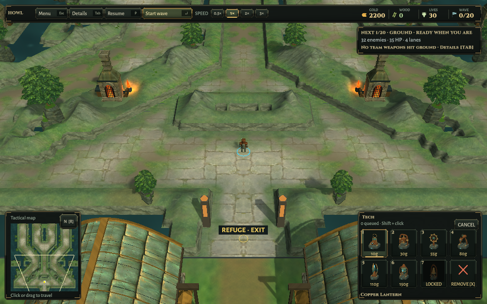
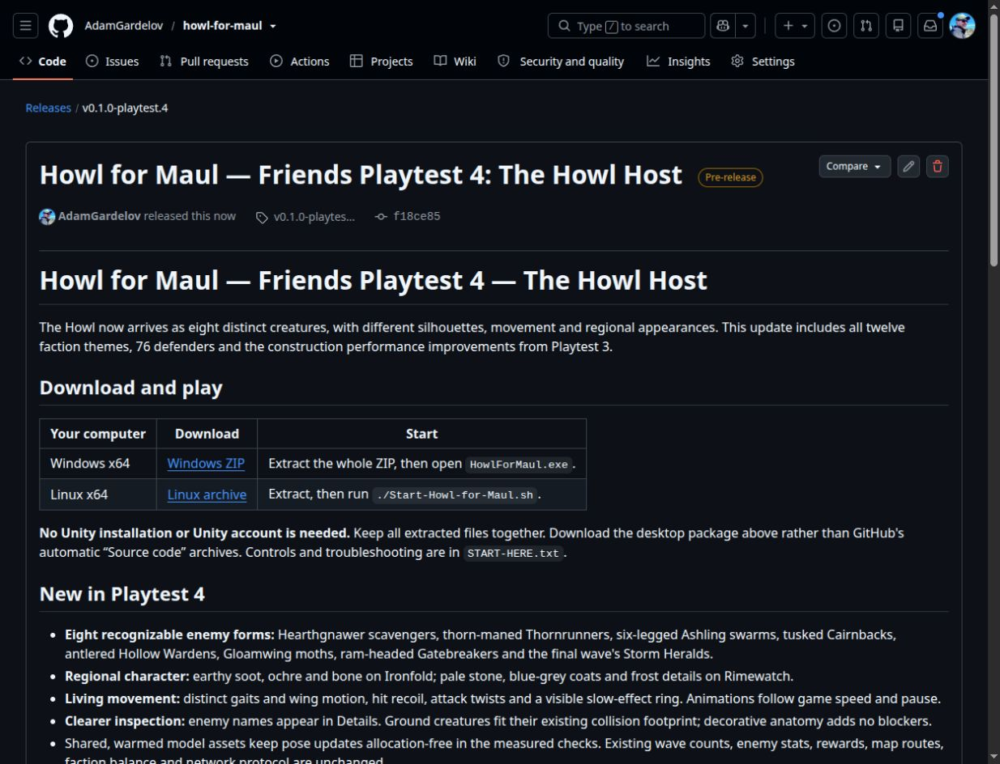

# Friends Playtest 4 — release verification

2026-10-10. Exact game source: `f18ce85ab18e7615e8463991794a68999a58b0ce`. The annotated `v0.1.0-playtest.4` tag points to the verified enemy presentation checkpoint. Underlying implementation, tests and limits: [The Howl host](../../HOWL-HOST.md), [verification](../Howl-Host/README.md).

## Packages and extracted runtime

Both source hashes and original player trees match the retained verification; the unmodified packaging guard passed. Archives contain 196 Linux / 197 Windows files. All archive members were read back and hashed, both packages extracted into fresh folders, and every payload hash, exact file count and build source revision checked. Linux executable and launcher modes are retained. Scott Buckley attribution, track sources, font licenses, start guide, build metadata and per-file hashes are bundled; debug-only folders and logs are excluded.

The extracted Linux binary passed both-map data checks with a clean normal-frame exit. The extracted shell launcher passed title/settings/credits, map choice, solo entry and 960×600 / 1440×900 HUD checks. The small HUD screenshot was inspected. Both runs exited cleanly using Linux software OpenGL on a private Xvfb display with isolated preferences. No new build was needed because the exact underlying binaries were already built and verified.

The underlying source passed 75 headless simulation regressions and 82 targeted Unity cases across two final runs, including both paid twenty-wave Hard campaigns, live-wave paid construction, creature footprint/pause/recoil and world/audio integration. Both-map local two-process networking and controlled creature renders passed. This is not a full Unity-suite, hardware-performance or human-playtest claim.

Native Windows execution, hardware GPU/FPS, fresh live Relay, separate-network, four-player and complete live online matches remain unverified. Prior Relay evidence remains historical. Enemy visuals are procedural and not final sculpted production art. Wave counts, collision radii, gameplay, rewards and protocol remain unchanged.

See the [manifest](RELEASE-MANIFEST.json), [checksums](SHA256SUMS.txt), [extraction evidence](Extraction.json), and [release notes](../../Releases/v0.1.0-playtest.4.md). Publication and anonymous-download evidence are added after verification.

## Publication

[Friends Playtest 4](https://github.com/AdamGardelov/howl-for-maul/releases/tag/v0.1.0-playtest.4) published at 2026-10-10T17:16:13Z as a prerelease. All four public assets were downloaded without credentials and matched local size/SHA-256 and GitHub digests. Release notes match the checked-in text after CRLF normalization; the remote annotated tag resolves to the exact package source. Evidence is in [Publication.json](Publication.json). Earlier release assets remain unchanged.

