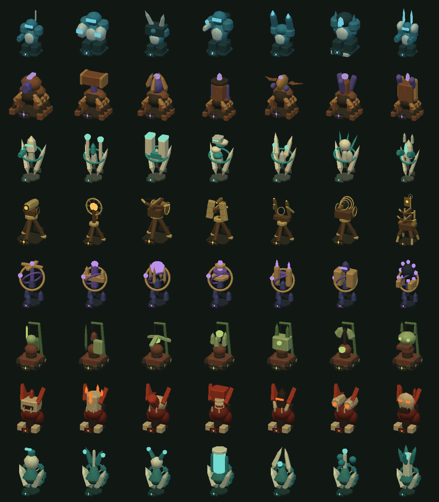
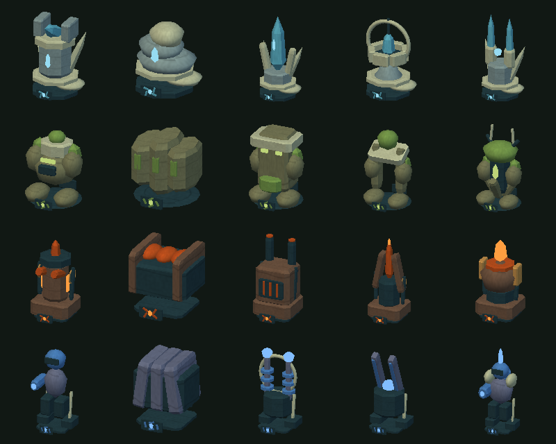

# Order weapon presentation verification

Base source: c078e9b. Unity 6000.3.25f1. Presentation geometry and colors changed, including matching projectile colors. No simulation, economy, mask, networking or audio source changed.

## Focused Unity checks

[Focused-Tests.xml](Focused-Tests.xml): 5/5 pass in the isolated project. Actual Unity rendering, OpenGL/llvmpipe on private Xvfb :98, separate XDG preferences.

- All 76 designs across both maps, including level-three weapons aimed diagonally: actual rendered vertices remain inside their occupied cells. Builders retain ownership, smooth motion, pause and paid-construction behavior. Shared actor meshes have texture coordinates and models have no colliders after initialization.
- All 76 portraits pass brightness and missing-shader checks without changing global lighting or world materials. Cached images remain stable; portrait cameras/copies are cleaned up.
- All 76 full-model placement previews remain cosmetic. Warmed updates allocate zero managed bytes across 300 calls per map, and material/copy caches are reused. Modal, inspection and tool gates still hide the copies.
- Existing actual-model portrait/minimap lifecycle and shot/recoil/pause checks pass.

The contact sheets and Horizon stage are actual model renders, visually inspected. The stage is a presentation fixture, not a paid game or a claim of performance on graphics hardware.

[Combat-Progression-Tests.xml](Combat-Progression-Tests.xml): a further 2/2 pass after the live check exposed pink Horizon projectiles. All 72 damaging designs retain unique shape/color signatures. Ground/flying endpoints, paid damage, chain colors, pause, speed-scaled expiration, the 64-effect cap and reset cleanup pass. The existing all-eight-Ironfold paid champion progression case passes, including six prerequisites, unlock, costs and upgrades. Actor colors were extracted unchanged into a shared palette used by shots.

## Packaged Linux input

Final-source build: real mouse/keyboard input through title → Ironfold → Solo → Horizon → Normal. Six regular designs built in order for 10 + 30 + 55 + 80 + 110 + 150 = 435 gold. Wallet moves from 2200 to 1765 with six towers and no pending orders. All seven portraits populate in the faction gallery; the champion remains wood-gated. Normal and close zoom were inspected, then the HUD 3× and Start Wave controls were used and the wave paused. The final capture shows approaching enemies, before they reached weapon range. The player closed normally, exit 0.

The earlier input run did reach combat (15 bounty gold gained), which exposed the legacy pink shots and prompted the correction. Final matching projectile colors are verified in the Unity-rendered all-roster projectile case and [Horizon projectile stage](Horizon-Projectiles.png); the final packaged screenshot is not evidence of a live colored shot. Neither input run is a full campaign or balance test. Both used private preferences and left the user’s desktop untouched.

Package/build evidence is recorded in Verification.json. Native Windows execution, hardware frame rate, full campaign balance and a separate-network multiplayer match are outside this presentation pass.

Both desktop builds succeed. The packaged Linux title/settings/credits/map/solo/resize check passes at 960×600 and 1440×900; screenshots inspected. Matching candidates are installed in `Builds/Linux-World` and `Builds/Windows-World`; preceding packages are preserved as `*-World-c078e9b`. Installed executable, runtime assembly and notices match the isolated build hashes. Scott Buckley attribution remains bundled. No public release was uploaded.

All test/build/player wrappers exit 0. The isolated editor target is restored to Linux, and all owned players, editors and private displays are closed. Scripts/logs begin `work/roster-` in the existing Codex work directory. No user editor/player was interrupted. No new full-suite, hardware performance, native Windows or separate-network result is claimed.
