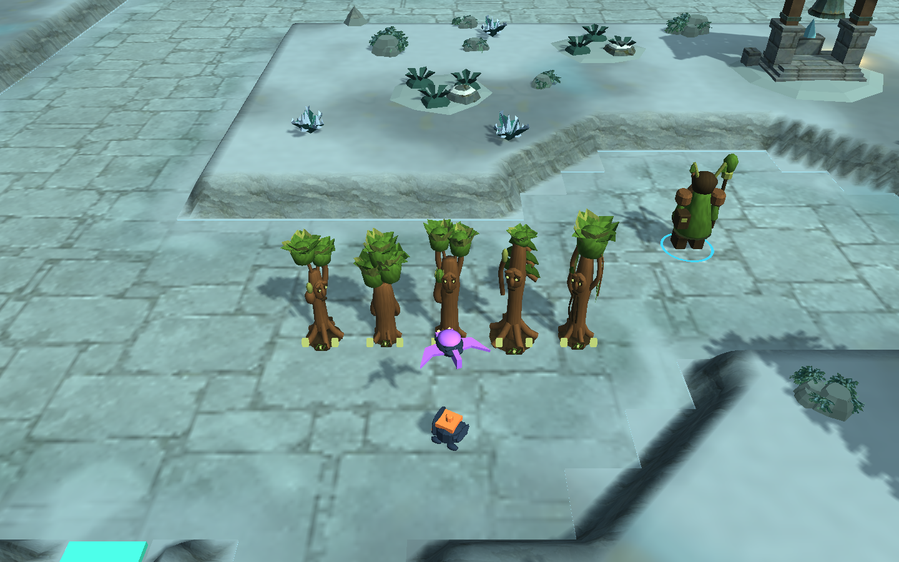

# Rootbound living tree guardians — 2026-10-10

Base source: `eead506`. [Faction identity charter and implementation](../../FACTION-IDENTITY-CHARTER.md).

The first living tree family replaces Stonebound's presentation on Rimewatch. Rootbound has a hazel Seedling Warden, oak Oldbark, chestnut Burr Elder, pine Skybough and willow Worldroot. Original heartwood, leaf and branch geometry gives them faces, different crowns, rooted feet and throwing limbs. Seed, thorn-pod, wingseed and sapling-shaped projectiles use earthy colors and launch at the appropriate tree height. Simulation-tick crown/branch movement freezes in pause. Existing weapon sounds and music are unchanged.

The other eleven orders are **not newly redesigned in this pass**. The charter records distinct future creature, spirit, person and workshop identities. These tree models are a procedural art iteration, not final sculpted character assets.

## Completed verification

- **7/7 focused Unity cases pass** on the final tree geometry (10:04:20 UTC): all 76 models/portraits, builders, preview reuse/cleanup, projectiles, the existing paid role/upgrade fixture and the new paid grove. The all-roster check retains level-three diagonal cell envelopes and UV/collider checks.
- **2/2 relevant cases pass** after the last projectile color adjustment and added live throwing-pose clearance assertion (10:07:22 UTC). These repeat the projectile and paid-grove cases; they are not two additional unique cases.
- The grove builds all five designs for **228 actual gold** from the real opening wallet. It checks crown motion, paused crowns, real ground/air damage, throwing arms, paused attacks, correct projectile launch height and unchanged terrain rows. Oldbark remains a non-attacking maze piece. All five designs are then upgraded with an explicitly added **1000-gold later-game fixture** to verify level-three animated cell clearance. This is not evidence that every upgrade is affordable at match start.
- The initial new grove test passed construction but failed when its opening wallet could not afford all those upgrades. The fixture was corrected; gameplay costs were not changed. The raw initial 6/7 result is retained. A visual iteration also replaced pointed trunks and disconnected foliage with heartwood profiles and connected crown branches before the 7/7 pass.
- **73/73 simulation regressions pass.** Local two-process direct multiplayer probes pass on both maps, including paid wallets, ownership, chat, game-data rejection, pause votes, all speeds, automatic waves and disconnect recovery. This is not a new live Relay or separate-network match.
- Final packaged Linux world checks pass on both maps. Ironfold builds eight paid defenses for 80 gold. Rimewatch builds the complete five-design Rootbound roster plus another seedling: **six paid defenses / 240 gold**, exhausting the unchanged opening wallet. Short combat uses synthetic ground/flying targets. Masks, mirrored scenery and centered R behavior pass.
- Packaged title/settings/credits/map-selection/solo/resize smoke passes. Model gallery, projectiles, close and normal paid views, packaged defense and the 960×600 Rootbound HUD were visually inspected. Unaffordable cards are intentionally dim after the QA defense spends the wallet.
- Linux and Windows builds report success. Windows remains a cross-build only. All owned Unity/player/display jobs closed, and the isolated target returned to Linux.

## Source and distribution

Only labels and one faction description change in the serialized Rimewatch map and scenario factory. Reversing those strings reproduces both old files exactly: numerical rules, map masks, ownership and economy are intact. Ironfold's map asset and all ten baked surface PNGs are byte-identical to the base. Changed runtime/test source matches the isolated build project. Installation hashes are in `Verification.json`.

Latest local candidates: `Builds/Linux-World` and `Builds/Windows-World`; preceding builds remain in `*-World-eead506`. Scott Buckley credits and all existing package notices remain bundled. **Public v0.1.0-playtest.1 remains unchanged** and does not include Rootbound or the preceding Pulse/camera fixes. No automation or cloud-service setting was changed.

No full Unity-suite, fresh human-input/full campaign, hardware GPU performance, native Windows or separate-network claim is made. Summoned saplings are projectile visuals, not autonomous allied units or new blockers. Further creature families, richer character animation, sound refinement and independent playtesting remain work.

## Captures

- [Model family and existing keeper](Rootbound-Gallery.png)
- [Normal camera distance](Paid-Normal.png)
- [Distinct seed projectiles](Seed-Projectiles.png)
- [Packaged defense](Packaged-Paid-Defense.png)
- [Small HUD](HUD-Small.png)
