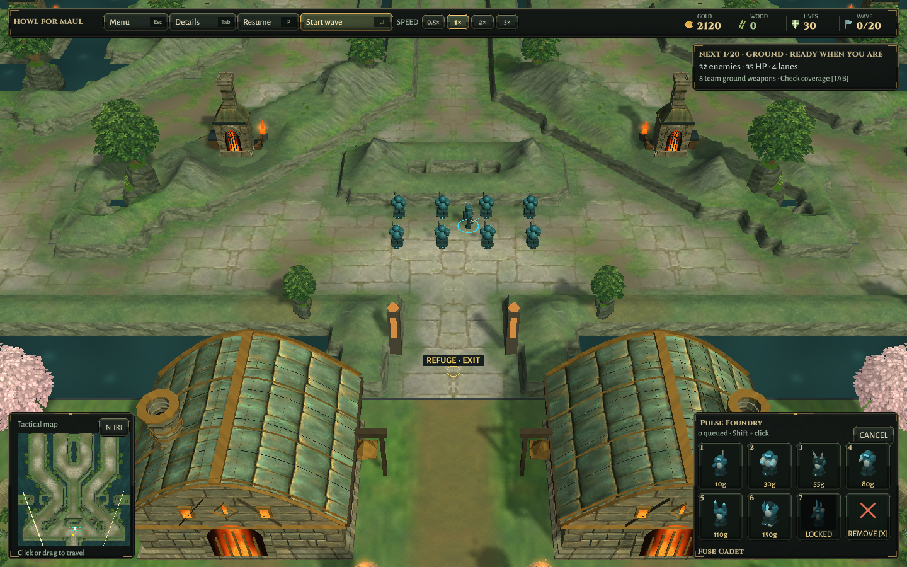
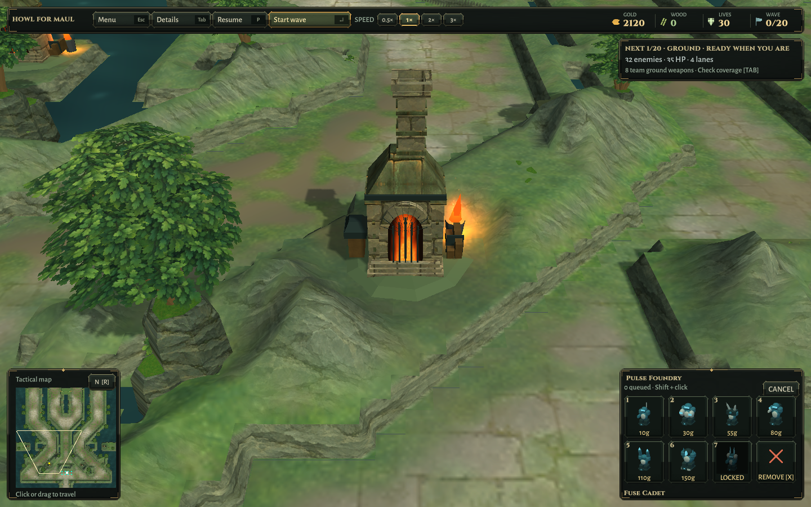
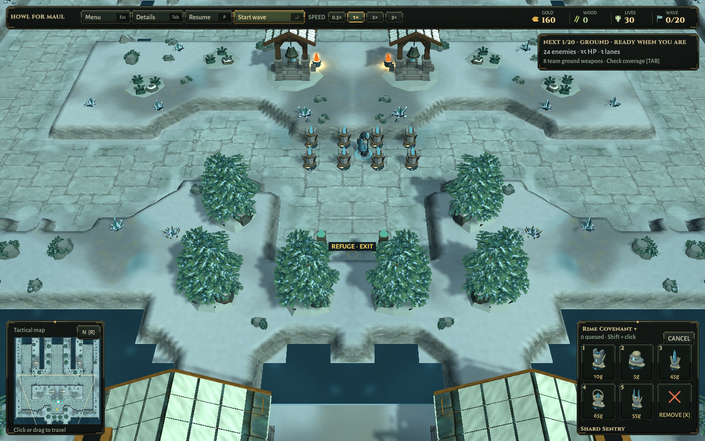
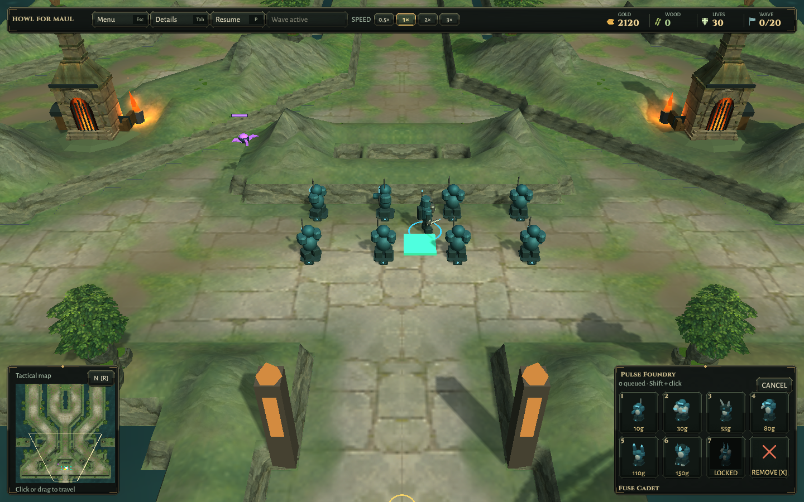
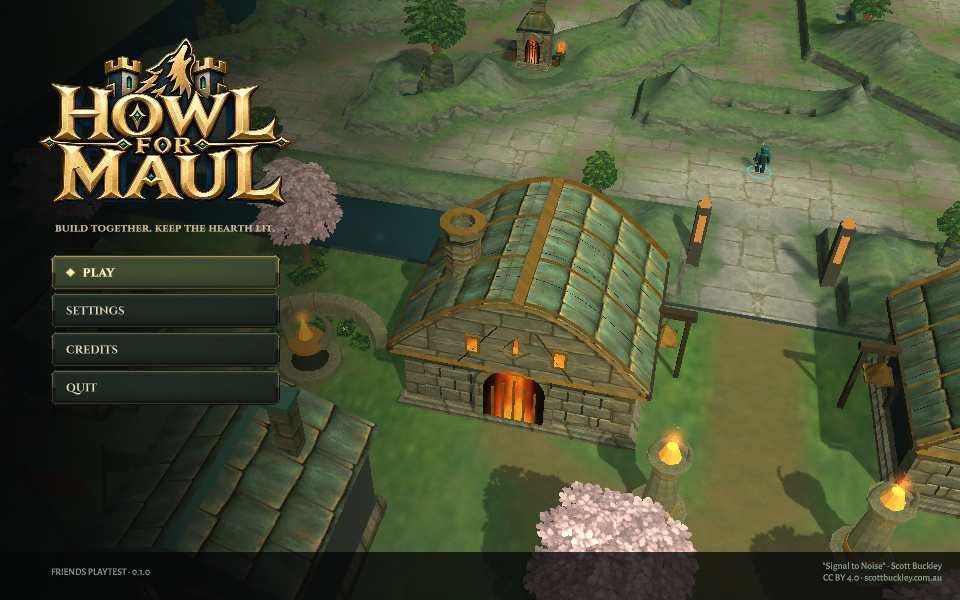
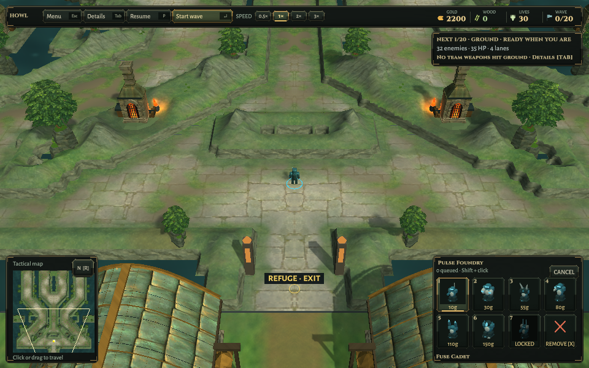

# Rounded walls — retained verification

2026-10-10, Unity 6000.3.25f1. Base source `afa8ff7`. [Implementation](../../ROUNDED-WALLS.md), [structured record and package hashes](Verification.json).

The final focused Unity run passed **4 cases / 0 failures**, ending **06:16:01 UTC**. A new geometry regression checks both maps: every positive-area surface triangle remains in an original solid cell; reflected vertices match; shared edge vertices have matching normals; square crown trim is absent; and all **3,398 exposed source edges** still have their exact low sealing foot. The existing world, paid-build, foliage/wind, pause, flight-clearance, roof-clearance, hearth audio/light-budget and map-cleanup cases also pass. No original clearance threshold was relaxed. This is a focused suite, not the entire Unity suite.

| Map | Final cap vertices | Edge quads generated | Original sealing edges checked |
|---|---:|---:|---:|
| Ironfold | 261,864 | 40,832 | 2,562 |
| Rimewatch | 83,808 | 12,640 | 836 |

The edge-quad count covers the whole source mask before left-half clipping/reflection; it is not a half-map count. Interior flat quads and existing snowy peak triangles are also included in final cap vertex totals. Static mesh complexity increased; no actual GPU frame-time claim is made. The cap/foot reuse existing draw batches and the repeated crown batch is removed.

All **73 simulation regressions pass**, including paid construction, tower-to-wall seals, dense corner crowds and queue skipping. Initial rendered results passed geometry tests but still advertised separate rounded cells. Diagonal cuts joined their upper profiles. A later close-up exposed the remaining dark low-foot outline; shelf pigment and upward lighting replaced the legacy masonry there. Three passing XML runs and the simulation output are retained; the initial run predates the new wall case.

Final rebuilt Linux world checks cover both maps with **eight paid towers / 80 gold each**, unchanged masks, mirrored refuge geometry and short combat against synthetic ground/flying targets. Last Stand, close forge, overview and paid-defense renders were inspected. These scene checks are not a new human-input session or full campaign balance run.

Final packaged title/settings/credits/map-change/solo/resize checks pass. Small title and HUD views were inspected. Linux and Windows builds succeed; Windows remains a cross-build only. Current local candidates are `Builds/Linux-World` and `Builds/Windows-World`; preceding packages are preserved as `*-World-afa8ff7`. Every installed file matches the isolated output, and changed source/assets match that project. Both map assets and all ten baked surface PNGs are byte-identical to the base. Baked fingerprints revalidate unchanged. Scott Buckley credits and bundled music notices remain intact.

The Unity Linux build logs a shutdown-time .NET SDK lookup diagnostic, but reports a successful build and exits successfully; the resulting player passes its scene checks. The host .NET runtime independently ran all 73 simulation checks. All owned editor/player/private-display jobs were closed and the isolated target restored to Linux. No new release, full-suite, native Windows, hardware FPS or separate-network match claim. Trees and smaller architecture remain below the concept target. No automation changes.
