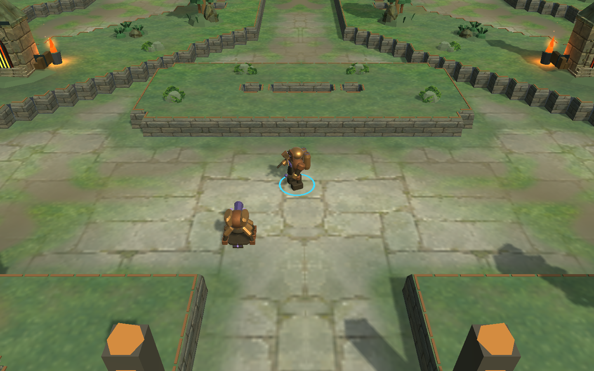
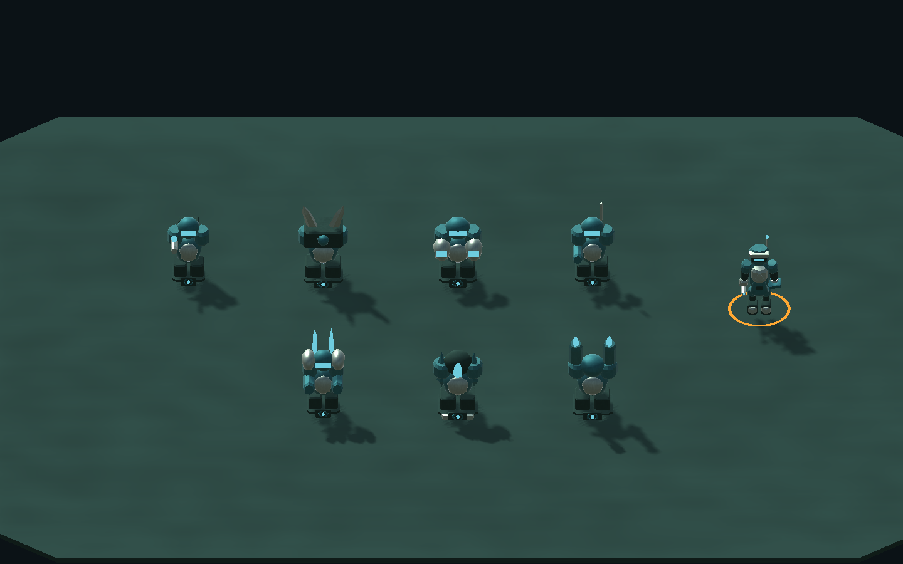
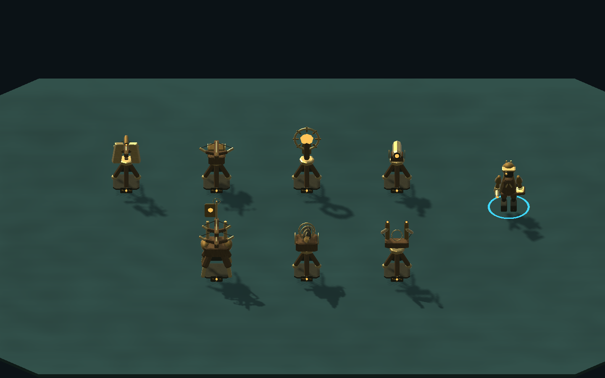
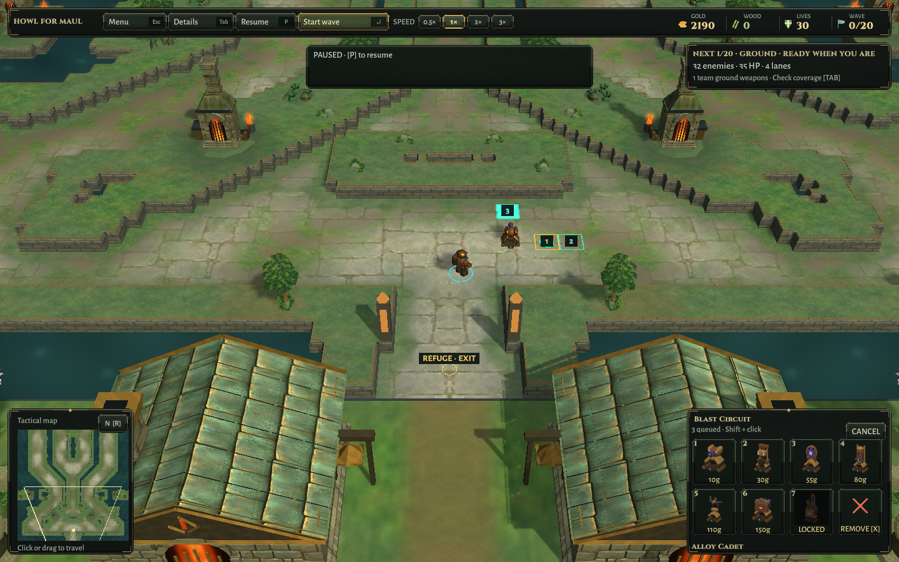
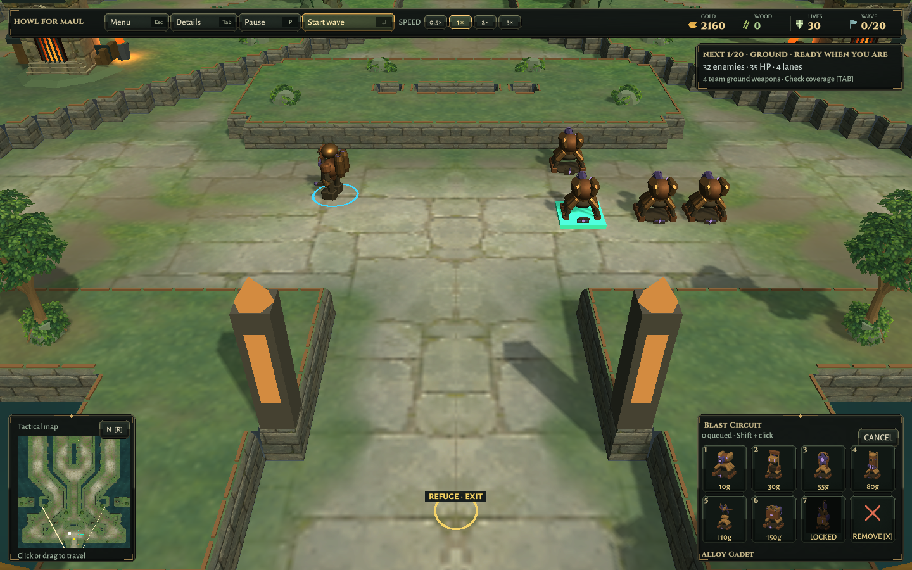
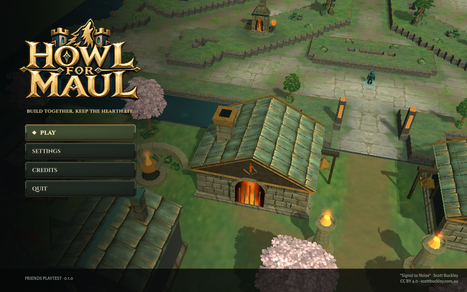
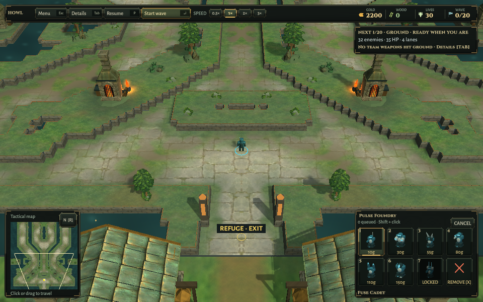

# Wardwright builder verification

2026-10-10 · base source e0d5679 · Unity 6000.3.25f1 · Linux OpenGL llvmpipe on private Xvfb :98.

[Final focused Unity run](Builder-World-Tests.xml): **3 passed, 0 failed**. The existing all-roster case still covers all 76 tower designs and all twelve builders, movement turns, frozen pose, owner changes, reset, material/UV data, collider absence and real paid construction. Added assertions check the compact neutral rendered envelope of all eight Ironfold builders and the unchanged owner-ring ground height. The existing both-map world/audio/paid-work regression passes as well.

The new paid-work case independently starts Pulse, Blast and Horizon, buys a nearby defense at its actual price, checks the hand/tool gesture advances with simulation steps, freezes during pause, keeps the builder grounded and the owner ring at 0.04, then checks the legs move during authoritative travel. These tests use simulation-controlled input in actual Unity scenes. The retained roster and paid-work renders were inspected; they are not hardware performance or full-campaign evidence.

The initial three-case run passed; the final run passed again after obsolete branches for the three replaced hover bodies were removed. No safety assertion was relaxed. Towers, economy, map masks and online logic are unchanged. No full-suite, native Windows, separate-network match or campaign-balance claim is made by this body pass.

Actual packaged Linux mouse/key input: title → Ironfold → Solo → Blast Circuit → Normal. Opening gold is 2200. One paid Alloy Cadet leaves 2190; pause and three Shift-click orders show all numbered footprints and a queue count of three. Move mode hides the placement model without removing pending work. Resume completes all four towers, exactly 2160 gold and zero queued orders. Movement away from the group and close zoom were inspected. The player closed normally, exit 0. This is a construction/presentation session, not a combat campaign.

Packaged menu/settings/credits/map/solo and 960×600–1440×900 resize checks pass ([smoke marker](Menu-Smoke.txt)); the small title and HUD were visually inspected. Linux and Windows builds succeed, with Windows cross-built only. The isolated target was restored to Linux and all owned player/editor/display processes are closed. The restore log has a shutdown-time Curl callback-aborted message; it still exits successfully.

Installed local candidates are `Builds/Linux-World` and `Builds/Windows-World`; preceding packages are preserved as `*-World-e0d5679`. Executable, runtime assembly, soundtrack source record and notices hashes match the isolated packages, and changed source matches the build clone. Scott Buckley attribution is retained. No new public release. Packaged input/build results and exact hashes are in [Verification.json](Verification.json).

