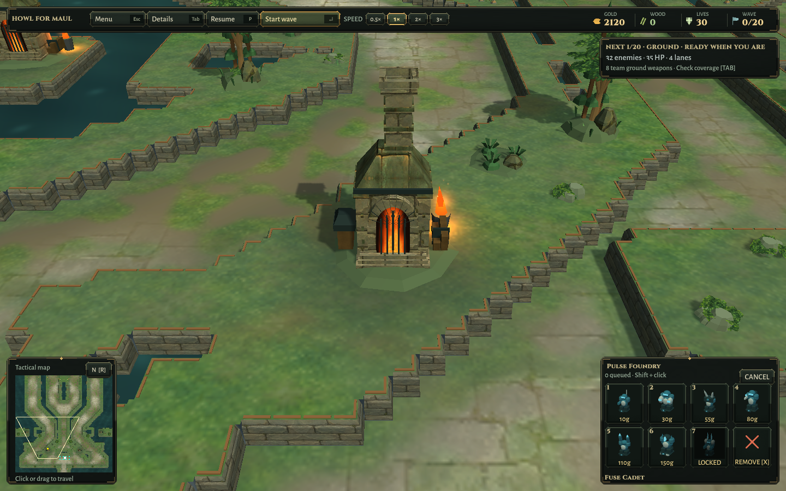
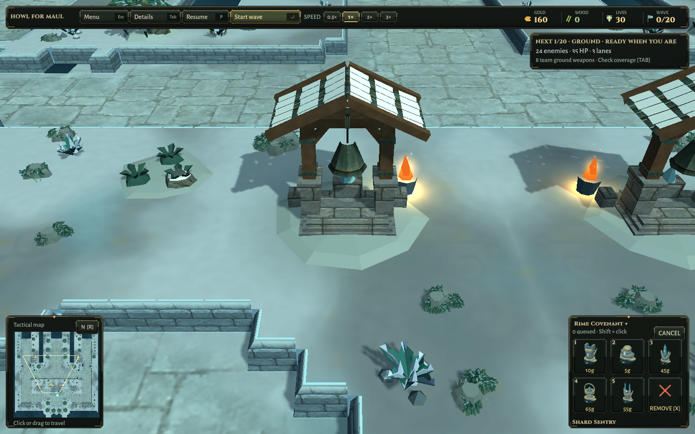
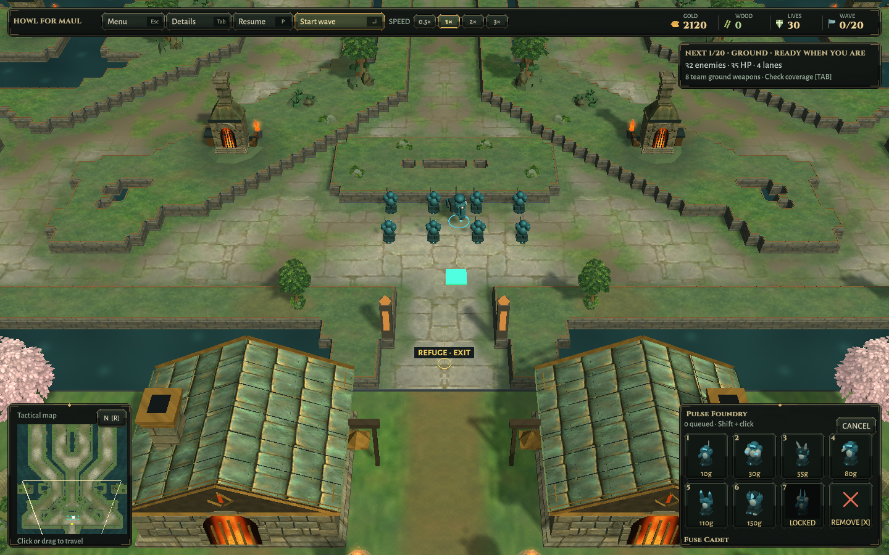

# Wayside landmarks verification

2026-10-10 · Unity 6000.3.25f1 · Linux x64 player · private Xvfb / OpenGL llvmpipe.

Final focused Unity run: **3 passed, 0 failed**. [Retained XML](WorldSafety.xml). Checks include every composition batch (including new materials), mirrored vertices, build-cell and flying-route clearance, texture/UV presence, generated texture cleanup, both-map foliage/house envelopes, baked surfaces, actual paid construction, combat/pause presentation and existing ambient audio/footstep regressions.

Initial run: **2 passed, 1 failed**. [Initial result](InitialCanopySymmetryFailure.xml). The added vertex-reflection assertion exposed the pre-existing inner-canopy wind using different horizontal phases/directions on each side. That sway was corrected; the complete three-case run then passed. Close inspection found a small gap in the bell suspension; after correcting it, the final three-case run passed again. No safety threshold was reduced.

[Packaged world check](PackagedWorld.txt): both maps pass with eight paid towers / 80 gold spent each, unchanged masks and mirrored refuge geometry. Synthetic ground and flying targets exercise short live combat presentation. This is not a new complete wave campaign, bot balance baseline or human-input playtest. Packaged screenshots at gameplay zoom and at the landmark camera were inspected. First detail captures cropped the roof/flue; the final QA camera is reframed to include them.

[Packaged menu check](PackagedMenu.txt) passes title/settings/credits, map switching, solo entry and 960×600–1440×900 resizing. The small title and HUD captures were inspected. Both desktop builds succeed; installed Linux/Windows candidates match the isolated build hashes, with preceding 9ff05e2 packages preserved.

The [structured record](Verification.json) records source and installed package hashes, build/menu outcomes and local log paths. Windows is cross-built only. Hardware performance, native Windows and new separate-network matches remain untested by this pass. Existing soundtrack and Scott Buckley attribution are unchanged.

