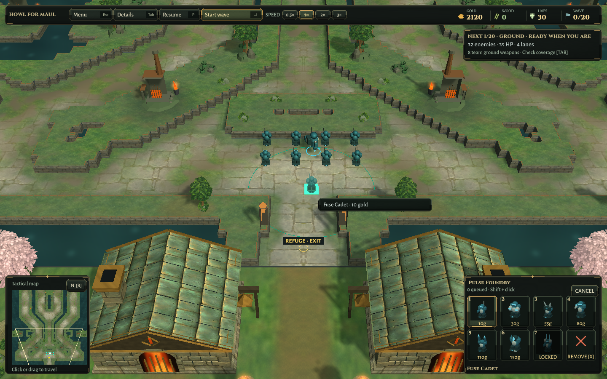
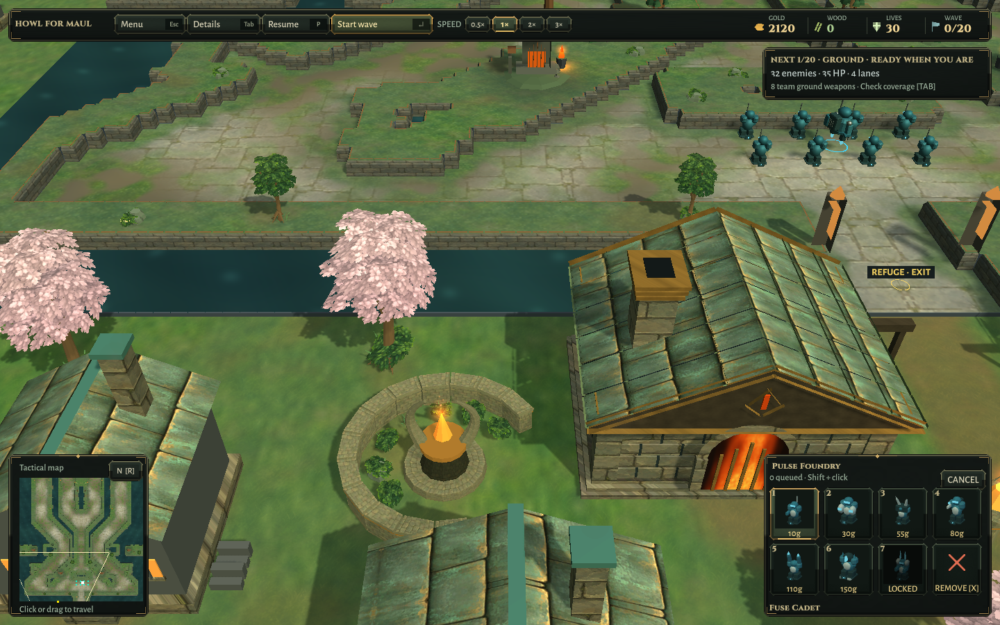
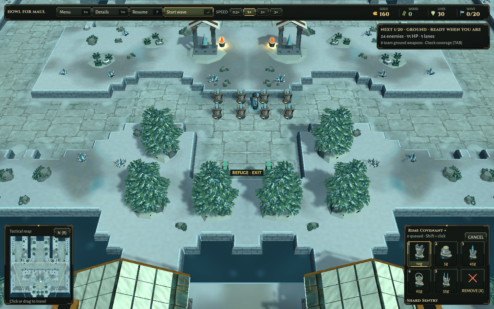
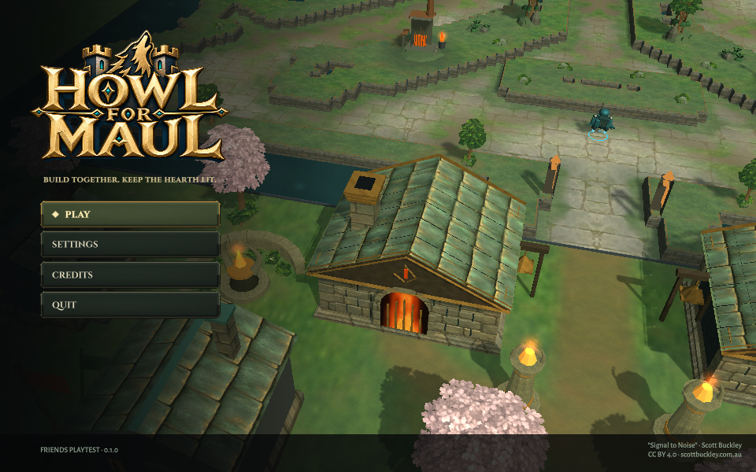

# Woodland composition verification

2026-10-10 · Unity 6000.3.25f1 · Linux x64 player · isolated Xvfb/OpenGL llvmpipe.

- Final existing geometry/baked-map tests: **2 passed, 0 failed**. [XML](LandscapeSafety.xml). Full windy triangles, solid cells, flying paths, house envelopes, mirrored vertices, paid construction and map-switch cleanup are checked.
- Initial run: **1 passed, 1 failed** because the first large-group layout removed too much Ironfold undergrowth. [Initial failure](InitialDensityFailure.xml). Compact groups fixed it; the tests and safety margins were not weakened. Final tree-placement changes also passed both tests.
- [Packaged both-map check](PackagedWorld.txt): eight paid towers and 80 gold spent per map, unchanged masks and mirrored refuge geometry. These are short presentation/paid-order checks with three synthetic combat targets; they are not twenty-wave balance campaigns.
- [Packaged menus](PackagedMenu.txt): title, settings, credits, resize, map selection, solo entry and frozen menu simulation pass. Screenshots inspected at 960×600 and 1440×900.
- Linux and Windows builds succeed. Windows is a cross-build, not a native runtime test. No hardware FPS, new complete campaign, separate-network match or commercial release claim.

The structured [verification record](Verification.json) records sources, package hashes and local logs. Earlier full simulation/Relay evidence remains historical, not re-certified by this presentation pass. Scott Buckley notices are retained in both candidates.

