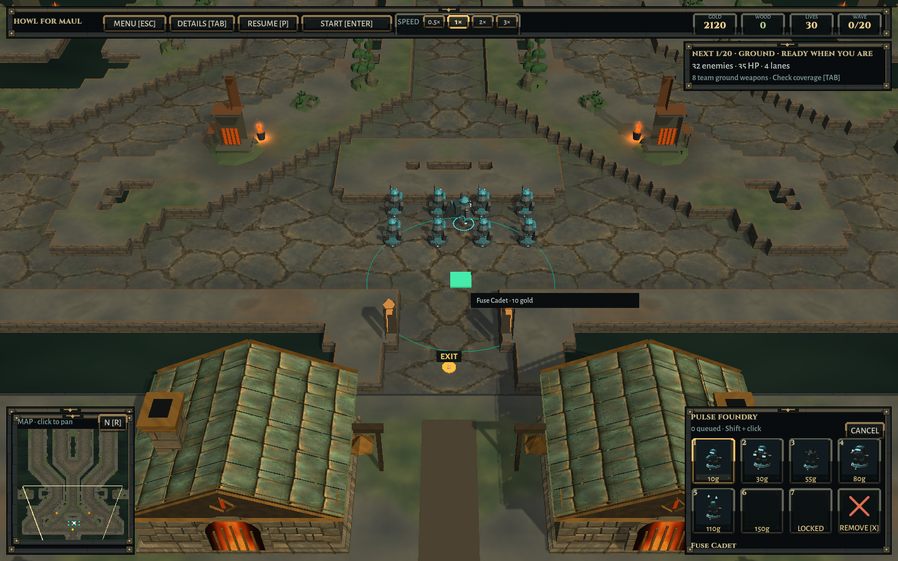
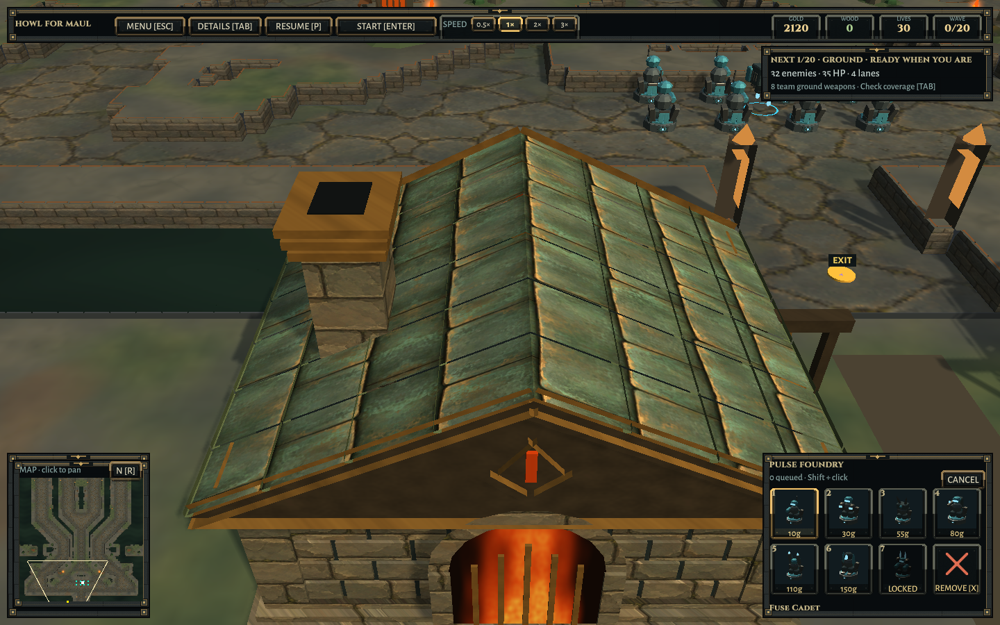
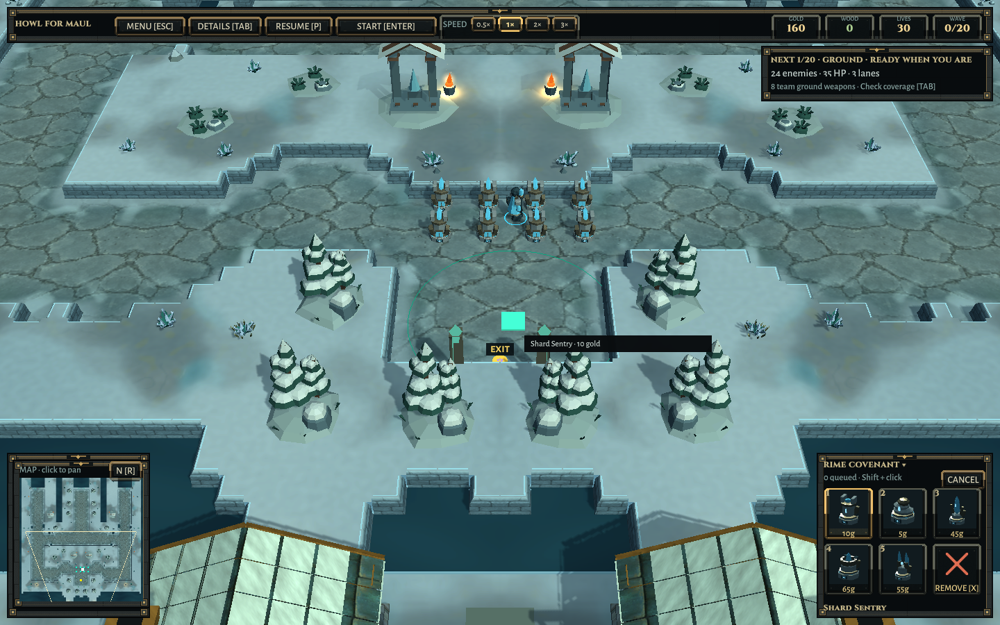

# World identity and presentation pass — 2026-10-09

## The requested priorities

1. **World identity:** the world bible establishes “warmth worth defending,” the Howl, wardwrights, twelve orders and two distinct settlements. The title and faction browser carry short pieces of this identity into play.
2. **Ironfold Last Stand:** original paired Anvilheart halls beyond the playable south boundary. Layered pitched roofs, inset furnace arches, stepped foundations, flues, bronze insignia and suspended wardbells frame the road home. The exit approach and flat back walls remain clear.
3. **Landmarks:** the same architectural family produces snow-covered Hearthward lodges for Rimewatch. Existing in-map shrines, furnaces and groves remain; no reference asset imports.
4. **Surfaces:** original generated painted slate replaces the regular rectangular road tiles. World-space pigment and weather washes keep both maps distinct, with smaller slabs and subdued joints. Reflected, slightly warped sampling avoids a hard texture-wrap discontinuity. Matching generated masonry and copper textures now cover lane-side walls, refuge masonry, new hall roofs and the surrounding settlement roofs. Snow caps and biome tinting preserve the winter character. Exact map masks remain authoritative.
5. **Lighting:** warmer Ironfold shade, cool Rimewatch fill, slightly softer shadows, and living hearth lights at the new refuges. Exterior lights share the existing four-active-light budget; no extra unbounded shadow lights.
6. **Towers and builders:** geometric order seals, enamel pennants and wardwright badges connect the existing faction models to their world. The complete existing 76-tower roster and twelve builders retain their distinct weapons and upgrades. This is a detailing pass, not a claim that every model has been replaced.
7. **Enemies:** eyes, jaw plates, overlapping hide, subtle tick-driven breathing and bounded turning. Rigid detail is combined into shared meshes by archetype/material; feet, wings and hit-reactive cores remain independent. Presentation never changes a unit's collision disc or route.
8. **Combat feel:** preserve the distinct material weapon bank, solid colored projectiles, recoil and hit reactions. Replace the electronic breach sweep with an original struck bronze wardbell with stereo reflections. Existing leak priority and cooldown remain.
9. **Interface and soundscape:** Cinzel headings and Alegreya Sans text across the HUD, menus and faction browser; concise faction mottos; local hearth ambience extends to the new buildings. Footstep detection now accounts for elapsed simulation ticks, retaining valid footsteps during frame catch-up and faster game speeds. Scott Buckley's music and visible attribution remain intact.
10. **Friends playtest:** prepare updated desktop packages and run the available automated campaign/network checks. A full match with friends on separate networks and native Windows testing require those participants/devices. Local automation is recorded separately and is not called a completed real friends playtest.

## Verification

Passed:

- 73/73 pure simulation regressions, including paid construction, wall seams, queues, economy and campaign rules.
- Complete 76-tower / twelve-builder presentation check; enemy silhouettes, shared hide batches, movement, pause and cleanup.
- Wardbell finite stereo sample/peak/envelope checks; live combat audio priority, volume and burst limits.
- Both-map scenery triangles remain outside walkable cells; no cosmetic colliders, correct particle bounds and no more than four active fire lights.
- New refuge geometry stays entirely south of the simulation rectangle, mirrors correctly and supports nearby normal paid construction without changing the map mask.
- Both twenty-wave two-player Hard campaigns replayed in Unity from freshly generated headless ledgers. Rimewatch: 339 purchases / 99 upgrades. Ironfold: 336 purchases / 375 upgrades. Both finish with 30 lives. Every travel count, purchase, upgrade, round wallet and kill/leak outcome reproduces; stable late-game view sync allocates zero managed bytes.
- Independent audit: 80 player wallets and 40 team-income calculations. Current ledger retained separately from the older historical campaign.
- Ambience volume/mute, paused work gestures, frozen gameplay versus moving foliage, actual construction, hit reactions, ordinary footsteps, multi-tick catch-up footsteps and map-change audio cleanup.
- Packaged title/settings/credits/map/solo entry and HUD at 1440×900 and 960×600; screenshots inspected. Final material captures and desktop package status are recorded in the structured report.
- Headless multiplayer validation: private passwords, version mismatch, capacity/late join rejection, unique starts, team economy, pause majorities, host speed authority, paid build ownership and separate-process synchronization.

See [structured verification](Verification/World-Identity.json). The initial failed attempts remain explicitly listed there. Tests are a focused presentation and gameplay set, not a claim that every Unity test or every faction/difficulty combination ran.

Initial diagnostics retained: the first packaged fixture rejected a mirrored vertex because opposite half-millimeter rounding landed in neighboring integer bins. The fixture now permits 0.001 world units of comparison tolerance, without changing geometry. An initial Unity test compile used a direct call to an internal audio factory across assemblies; the test now follows the project's existing reflection pattern for internal helpers. Neither initial result is counted as a pass.

The built-in image-generation tool created HearthSlate; the returned image, full prompt, import treatment and provenance are recorded in [WORLD-ASSET-PROVENANCE.md](WORLD-ASSET-PROVENANCE.md).

## Friends acceptance run

Use the same packaged version. One player chooses Online, creates a private lobby and shares the invite code and optional password. Join from a separate network, choose different factions and starts, vote difficulty, then play all twenty waves. Try queued construction, upgrade/sell ownership, host speed changes, group pause/resume and a guest disconnect. Record map, factions, difficulty, OS, wave, and any screenshot/log. A host closing the game ends the session; host migration and mid-match reconnect remain outside this build.


## Packages

- Linux: `Builds/Linux-World/HowlForMaul` — rendered and exercised locally, including both-map live Relay probes and all-lane route smoke.
- Windows: `Builds/Windows-World/HowlForMaul.exe` — matching source cross-build succeeded; native execution remains untested.
- Friends archives are created with matching source identifiers, checksums, composer/music credits and font licenses. No GitHub release upload is claimed.

To launch locally:

```sh
/home/adam/Documents/Dev/howl-for-maul/Builds/Linux-World/HowlForMaul -force-wayland
```

Relay probes used two Linux processes on the same network: both maps completed lobby setup, two paid builds, 420 synchronized ticks, pause/resume and disconnect recovery. They are not a full remote friends match.

## Actual game captures

These are screenshots from the Linux player with eight ordinarily purchased towers per map, not concept renders.







This establishes the next material standard. Trees, smaller props and several actor surfaces still use the existing procedural art; this pass does not claim that every asset has the same painted finish yet.
